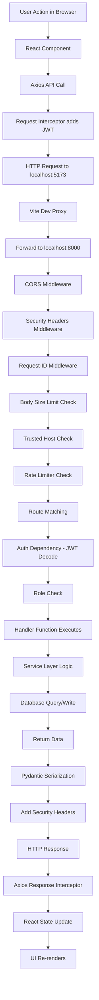
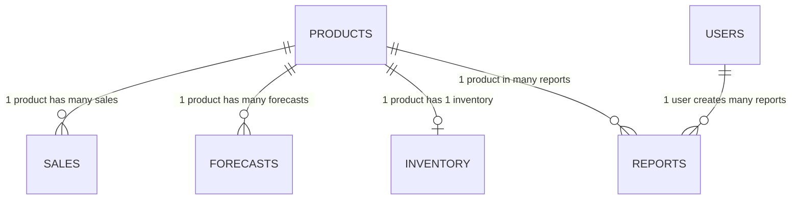

# Retail Demand Forecasting — Complete Learning Document (Volume 2)

> **Sections 4–10: Architecture Details, Code Explanation, Execution Flow, Frontend, Backend, Database**

---

## Section 4 — Complete Folder Structure

### 4.1 Full Project Tree

```
retail_demand_forecasting/
├── backend/
│   ├── routers/                    # API route handlers (controllers)
│   │   ├── __init__.py, auth.py, dashboard.py, forecast.py
│   │   ├── inventory.py, products.py, reports.py, sales.py
│   ├── services/                   # Business logic + ML
│   │   ├── __init__.py, forecast_service.py, inventory_service.py
│   │   ├── lstm_service.py, prophet_service.py, report_service.py, xgboost_service.py
│   ├── utils/                      # Shared utilities
│   │   ├── __init__.py, metrics.py, seasonal.py
│   ├── __init__.py, auth.py, config.py, database.py, main.py
│   ├── models.py, schemas.py, seed_data.py
├── frontend/src/
│   ├── api/client.js               # Axios instance + endpoints
│   ├── components/                  # Sidebar, Topbar, ProtectedRoute, ToastContext, useApi
│   ├── context/AuthContext.jsx      # Auth state management
│   ├── pages/                       # Dashboard, Forecast, Inventory, Login, Products, Reports, Sales, Seasonal
│   ├── styles/index.css             # Complete design system (881 lines)
│   ├── utils/format.js             # Number/date formatters
│   ├── App.jsx, main.jsx
├── data/                            # SQLite DB + reports + model artifacts
├── database/init.sql, docs/, tests/test_api.py
├── install.py, run.py, requirements.txt, .env.example
```

### 4.2 Folder Purpose Explanations

| Folder | Purpose | Analogy |
|--------|---------|---------|
| `backend/` | All server-side Python code | The brain of the application |
| `backend/routers/` | URL → function mapping (controllers) | A receptionist directing calls |
| `backend/services/` | Business logic + ML training/prediction | The workers doing actual work |
| `backend/utils/` | Shared helper functions | Tools everyone borrows |
| `frontend/` | React UI codebase | The face of the application |
| `frontend/src/api/` | HTTP client for backend communication | The phone line to the server |
| `frontend/src/components/` | Reusable UI building blocks | LEGO pieces |
| `frontend/src/context/` | Global state (auth, toasts) | A shared bulletin board |
| `frontend/src/pages/` | Full page layouts (one per route) | Rooms in a building |
| `frontend/src/styles/` | CSS design system | Paint and decoration |
| `data/` | Runtime storage (DB, reports, models) | The filing cabinet |
| `tests/` | Automated tests | Quality inspector |

---

## Section 5 — Every File Explanation

### 5.1 `backend/main.py` — The Application Core (292 lines)

**Purpose:** Creates and configures the FastAPI application.

**What it does (step by step):**
1. Imports all dependencies (FastAPI, middleware, routers)
2. Configures Python logging (INFO level, timestamped)
3. Defines `BodySizeLimitMiddleware` — rejects POST/PUT/PATCH requests > 10MB
4. Defines security headers dict (CSP, HSTS, X-Frame-Options, etc.)
5. Defines relaxed CSP for docs pages (allows CDN scripts for Swagger UI)
6. Defines `SecurityHeadersMiddleware` — adds security headers to every response
7. Defines `RequestIdMiddleware` — generates UUID per request for tracing
8. Defines `lifespan()` — async context manager that initializes DB on app startup
9. Creates `FastAPI` app with disabled default docs (we use custom routes)
10. Adds CORS middleware (allows configured origins)
11. Adds all custom middleware in order
12. Adds SlowAPI rate limiter
13. Registers exception handlers (validation errors → 422, generic errors → 500)
14. Defines GET `/` → returns app name + version
15. Defines GET `/health` → returns `{"status": "ok"}`
16. Defines custom GET `/docs` → Swagger UI with forced light-mode CSS
17. Defines custom GET `/redoc` → ReDoc with forced light-mode CSS
18. Mounts all 7 routers under `/api/v1`

**Why custom docs routes?** Browser dark-mode makes Swagger UI text invisible. Custom routes inject CSS that forces light background/text colors.

---

### 5.2 `backend/config.py` — Settings Management (102 lines)

**Purpose:** Single source of truth for ALL configuration values.

**Complete Settings Reference:**

| Setting | Default | Purpose |
|---------|---------|---------|
| `APP_NAME` | "Retail Demand Forecasting System" | Display name |
| `APP_VERSION` | "1.1.0" | Version string |
| `DEBUG` | False | Enable debug mode |
| `API_V1_PREFIX` | "/api/v1" | API URL prefix |
| `DATABASE_URL` | "sqlite:///data/retail_forecast.db" | Database connection |
| `DB_ECHO` | False | Log SQL queries |
| `SECRET_KEY` | Auto-generated 64-byte token | JWT signing key |
| `JWT_ALGORITHM` | "HS256" | JWT algorithm |
| `ACCESS_TOKEN_EXPIRE_MINUTES` | 480 (8 hours) | Access token lifetime |
| `REFRESH_TOKEN_EXPIRE_MINUTES` | 10080 (7 days) | Refresh token lifetime |
| `BCRYPT_ROUNDS` | 12 | Password hash cost |
| `CORS_ORIGINS` | ["http://localhost:5173", ...] | Allowed origins |
| `RATE_LIMIT_DEFAULT` | "120/minute" | Global rate limit |
| `RATE_LIMIT_FORECAST` | "10/minute" | Forecast endpoint limit |
| `RATE_LIMIT_AUTH` | "10/minute" | Auth endpoint limit |
| `FORECAST_HORIZON_DAYS` | 30 | Default forecast days |
| `PROPHET_INTERVAL_WIDTH` | 0.95 | Prophet CI width |
| `XGB_N_ESTIMATORS` | 500 | XGBoost trees |
| `LSTM_EPOCHS` | 20 | LSTM training epochs |
| `LSTM_SEQUENCE_LENGTH` | 30 | LSTM input window |
| `SAFETY_STOCK_DAYS` | 7 | Safety stock horizon |
| `REORDER_LEAD_DAYS` | 5 | Default lead time |
| `SAFETY_STOCK_Z` | 1.65 | Z-score (95% service) |
| `MAX_UPLOAD_BYTES` | 10,485,760 (10MB) | Max upload size |
| `MAX_CSV_ROWS` | 200,000 | Max CSV rows |

---

### 5.3 `backend/database.py` — DB Connection (40 lines)

**Line-by-line explanation:**

```python
from sqlalchemy import create_engine
```
Imports the engine factory — creates a connection pool to the database.

```python
from sqlalchemy.orm import sessionmaker, declarative_base
```
`sessionmaker` — factory for creating sessions; `declarative_base` — base class for ORM models.

```python
_connect_args = {"check_same_thread": False} if settings.DATABASE_URL.startswith("sqlite") else {}
```
SQLite requires this flag because FastAPI uses multiple threads but SQLite connections are thread-local by default.

```python
engine = create_engine(settings.DATABASE_URL, echo=settings.DB_ECHO, connect_args=_connect_args, pool_pre_ping=True)
```
Creates the engine. `pool_pre_ping=True` tests connections before use (handles stale connections).

```python
SessionLocal = sessionmaker(autocommit=False, autoflush=False, bind=engine)
```
Creates a session factory. `autocommit=False` means we must explicitly `db.commit()`. `autoflush=False` prevents auto-flushing before queries.

```python
Base = declarative_base()
```
All ORM models inherit from this class to be registered with SQLAlchemy's metadata system.

```python
def get_db():
    db = SessionLocal()
    try:
        yield db
    finally:
        db.close()
```
FastAPI dependency — creates a session, yields it to the handler, and guarantees cleanup.

```python
def init_db():
    from . import models  # noqa
    Base.metadata.create_all(bind=engine)
```
Creates all tables. Imports models first so they register with Base.metadata.

---

### 5.4 `backend/models.py` — ORM Models (114 lines)

**User Model:**
```python
class User(Base):
    __tablename__ = "users"
    id = Column(Integer, primary_key=True)
    username = Column(String(64), unique=True, nullable=False, index=True)
    email = Column(String(256), unique=True, nullable=True, index=True)
    full_name = Column(String(128), nullable=True)
    hashed_password = Column(String(256), nullable=False)
    role = Column(String(32), nullable=False, default="analyst")
    is_active = Column(Integer, nullable=False, default=1)
    created_at = Column(DateTime, default=datetime.utcnow)
    last_login_at = Column(DateTime, nullable=True)
```
- `index=True` on username/email enables fast lookups (O(log n) instead of O(n))
- `unique=True` prevents duplicate usernames/emails at the database level
- `role` defaults to "analyst" (safest non-admin role)

**Product Model:**
```python
class Product(Base):
    __tablename__ = "products"
    id = Column(Integer, primary_key=True)
    sku = Column(String(64), unique=True, nullable=False, index=True)
    name = Column(String(256), nullable=False)
    category = Column(String(128), index=True)
    unit_cost = Column(Float, default=0)
    unit_price = Column(Float, default=0)
    lead_time_days = Column(Integer, default=5)
    
    sales = relationship("Sale", back_populates="product", cascade="all, delete-orphan")
    inventory = relationship("Inventory", back_populates="product", uselist=False, cascade="all, delete-orphan")
    forecasts = relationship("Forecast", back_populates="product", cascade="all, delete-orphan")
```
- `cascade="all, delete-orphan"` — deleting a product auto-deletes its sales/forecasts/inventory
- `uselist=False` on inventory — one product has exactly one inventory record

**Sale Model:**
```python
class Sale(Base):
    __tablename__ = "sales"
    id = Column(Integer, primary_key=True)
    product_id = Column(Integer, ForeignKey("products.id", ondelete="CASCADE"), nullable=False, index=True)
    sale_date = Column(Date, nullable=False, index=True)
    quantity = Column(Float, default=0)
    revenue = Column(Float, default=0)
    
    __table_args__ = (Index("idx_sales_product_date", "product_id", "sale_date"),)
```
- Composite index `idx_sales_product_date` speeds up queries filtering by both product and date (most common query pattern)
- `ondelete="CASCADE"` — database-level cascade (backup for ORM cascade)

---

### 5.5 `backend/auth.py` — Security Layer (125 lines)

**Password Hashing:**
```python
pwd_context = CryptContext(schemes=["bcrypt"], deprecated="auto", bcrypt__rounds=settings.BCRYPT_ROUNDS)
```
- Uses passlib's CryptContext for scheme management
- `bcrypt__rounds=12` means 2^12 = 4096 iterations (takes ~250ms to hash)
- `deprecated="auto"` automatically upgrades old hashes on verify

**JWT Creation:**
```python
def _create_token(subject: str, token_type: str, expires_minutes: int) -> str:
    expire = datetime.utcnow() + timedelta(minutes=expires_minutes)
    payload = {"sub": subject, "type": token_type, "iat": int(datetime.utcnow().timestamp()), "exp": int(expire.timestamp())}
    return jwt.encode(payload, settings.SECRET_KEY, algorithm=settings.JWT_ALGORITHM)
```
- `sub` (subject) contains user ID
- `type` differentiates access vs refresh tokens
- `iat` (issued at) and `exp` (expiration) are standard JWT claims
- Signed with HS256 (HMAC-SHA256) using the SECRET_KEY

**Access Control Dependency:**
```python
def get_current_user(token: str = Depends(oauth2_scheme), db: Session = Depends(get_db)) -> models.User:
    return _user_from_token(token, db)
```
- `oauth2_scheme` auto-extracts Bearer token from Authorization header
- Decodes token → validates type == "access" → queries user from DB → checks active
- If any step fails → HTTP 401 Unauthorized

**Role-Based Factory:**
```python
def require_role(*roles: str):
    allowed = set(roles)
    def _dep(user: models.User = Depends(get_current_user)) -> models.User:
        if user.role not in allowed:
            raise HTTPException(403, f"Required role(s): {', '.join(sorted(allowed))}")
        return user
    return _dep
```
- Usage: `Depends(require_role("admin", "analyst"))` 
- First authenticates (get_current_user), then checks role membership

---

## Section 6 — Line by Line Code Explanation (Key Files)

### 6.1 `backend/services/forecast_service.py` — Complete Line-by-Line

```python
"""Forecast orchestration: route to right model, persist results, compare models."""
```
Docstring explaining file purpose.

```python
from __future__ import annotations
```
Enables postponed evaluation of annotations (PEP 563) — allows forward references in type hints.

```python
from typing import Dict
from sqlalchemy.orm import Session
import pandas as pd
```
Type hints, database session type, and Pandas for date manipulation.

```python
from .. import models
from ..config import settings
from . import prophet_service, xgboost_service, lstm_service
```
Relative imports: models from parent package, settings, and sibling service modules.

```python
MODEL_REGISTRY = {
    "prophet": prophet_service,
    "xgboost": xgboost_service,
    "lstm": lstm_service,
}
```
**Registry Pattern** — Maps string names to service modules. Enables routing via: `MODEL_REGISTRY["prophet"].fit_predict(...)`. Adding a new model only requires adding one entry here.

```python
def _load_series(db: Session, product_id: int):
    rows = db.query(models.Sale).filter(models.Sale.product_id == product_id).order_by(models.Sale.sale_date.asc()).all()
    if not rows:
        raise ValueError("No sales history for this product")
    return [r.sale_date for r in rows], [float(r.quantity) for r in rows]
```
- Queries all sales for a product, ordered by date (ascending)
- Returns two parallel lists: dates and quantities
- Raises ValueError if no history (caught by router and returned as HTTP 400)

```python
def run_forecast(db: Session, product_id: int, model_name: str, horizon_days: int) -> Dict:
    if model_name not in MODEL_REGISTRY:
        raise ValueError(f"Unknown model '{model_name}'")
    if not db.query(models.Product).filter(models.Product.id == product_id).first():
        raise ValueError(f"Product {product_id} not found")
```
- Validates model name exists in registry
- Validates product exists in database

```python
    dates, qtys = _load_series(db, product_id)
    service = MODEL_REGISTRY[model_name]
    forecasts, metrics = service.fit_predict(dates, qtys, horizon_days)
```
- Loads historical sales data
- Gets the appropriate service module from registry
- Calls `fit_predict()` — the common interface all models implement

```python
    db.query(models.Forecast).filter(
        models.Forecast.product_id == product_id,
        models.Forecast.model_name == model_name,
    ).delete()
```
- Deletes previous forecasts for this product+model combination
- This ensures we always have only the latest forecast (not duplicates)

```python
    for f in forecasts:
        db.add(models.Forecast(
            product_id=product_id, model_name=model_name,
            forecast_date=pd.to_datetime(f["forecast_date"]).date(),
            predicted_quantity=f["predicted_quantity"],
            lower_bound=f["lower_bound"], upper_bound=f["upper_bound"],
            horizon_days=horizon_days,
            mae=metrics["mae"], rmse=metrics["rmse"], mape=metrics["mape"],
        ))
    db.commit()
```
- Inserts one row per forecasted day
- Each row stores the prediction + confidence bounds + metrics
- Commits all at once (atomic transaction)

```python
    total_pred = round(sum(f["predicted_quantity"] for f in forecasts), 2)
    return {
        "product_id": product_id, "model_name": model_name,
        "horizon_days": horizon_days, "metrics": metrics,
        "total_predicted": total_pred, "forecasts": forecasts,
    }
```
- Sums total predicted demand over the horizon
- Returns complete result dict (serialized to JSON by FastAPI)

---

### 6.2 `backend/services/inventory_service.py` — Key Logic Explained

```python
def _daily_stats(dates, qtys):
    s = pd.Series(qtys, index=pd.to_datetime(dates))
    s = s.groupby(s.index.date).sum()
    return float(s.mean()), float(s.std())
```
- Creates a Pandas Series with dates as index
- Groups by date (in case multiple entries per day) and sums quantities
- Returns mean daily demand and standard deviation

```python
safety_stock = Z * std_daily * math.sqrt(max(lead, 1))
```
**The Safety Stock Formula:**
- Z = 1.65 (corresponds to 95% service level from normal distribution)
- σ_daily = standard deviation of daily demand
- √(lead_time) = accounts for demand variability over the lead time period
- Interpretation: "Buffer stock to handle demand spikes during reorder wait"

```python
reorder_point = avg_daily * lead + safety_stock
```
**The Reorder Point Formula:**
- avg_daily × lead = expected demand during lead time
- + safety_stock = buffer for uncertainty
- Interpretation: "Order when stock drops to this level"

```python
recommended = max(0.0, expected_demand_horizon + safety_stock - current_stock)
```
- How much to order = what you'll need - what you have
- `max(0.0, ...)` ensures we never recommend negative order quantities

---

### 6.3 `frontend/src/api/client.js` — Key Code Explained

```javascript
const api = axios.create({
  baseURL: API_BASE,
  timeout: 120000,
  headers: { 'Content-Type': 'application/json' },
})
```
- Creates Axios instance with 2-minute timeout (LSTM training can take 30-60 seconds)
- Default content type is JSON

```javascript
api.interceptors.request.use((config) => {
  try {
    const raw = localStorage.getItem(STORAGE_KEY)
    if (raw) {
      const { access_token } = JSON.parse(raw)
      if (access_token) {
        config.headers.Authorization = `Bearer ${access_token}`
      }
    }
  } catch { /* ignore */ }
  return config
})
```
- **Request Interceptor** — runs before every outgoing request
- Reads JWT from localStorage
- Attaches as `Authorization: Bearer <token>` header
- try/catch prevents crashes if localStorage is corrupted

```javascript
api.interceptors.response.use(
  (r) => r,
  (err) => {
    if (err.response?.status === 401 && _on401) { _on401() }
    const msg = err.response?.data?.detail || err.message || 'Request failed'
    return Promise.reject(new Error(typeof msg === 'string' ? msg : JSON.stringify(msg)))
  }
)
```
- **Response Interceptor** — catches errors
- If 401 (Unauthorized): calls the logout callback (clears auth, redirects to login)
- Normalizes error messages for consistent error handling

```javascript
downloadReport: async (id) => {
    const res = await api.get(`/reports/download/${id}`, { responseType: 'blob' })
    const cd = res.headers['content-disposition'] || ''
    const match = /filename\*?=(?:UTF-8'')?"?([^";]+)"?/i.exec(cd)
    const filename = match ? decodeURIComponent(match[1]) : `report_${id}`
    const url = URL.createObjectURL(res.data)
    const a = document.createElement('a')
    a.href = url; a.download = filename
    document.body.appendChild(a); a.click(); a.remove()
    URL.revokeObjectURL(url)
}
```
- **Blob Download Pattern** — needed because `/reports/download` requires JWT auth
- A regular `<a href="...">` link can't send Authorization headers
- Solution: fetch as blob (binary) → create object URL → trigger download → cleanup

---

## Section 7 — Execution Flow

### 7.1 Complete Request Lifecycle



### 7.2 Login Flow (Detailed)

1. **User** types username + password on Login page
2. **Login.jsx** calls `endpoints.login(username, password)`
3. **client.js** creates `URLSearchParams` body (OAuth2 form format)
4. **Axios** sends `POST /api/v1/auth/login` with `Content-Type: application/x-www-form-urlencoded`
5. **Vite proxy** forwards to `http://localhost:8000/api/v1/auth/login`
6. **FastAPI** matches route to `routers/auth.py → login()`
7. **login()** queries User by username from database
8. **verify_password()** compares bcrypt hash (constant-time)
9. If match: updates `last_login_at`, creates access + refresh tokens
10. Returns `TokenOut` with tokens + user info
11. **client.js** receives response, `Login.jsx` calls `authContext.login(data)`
12. **AuthContext** stores tokens + user in localStorage
13. **App.jsx** re-renders → `isAuthenticated` is now true → shows app layout

### 7.3 Forecast Flow (Detailed)

1. **User** selects product, model, horizon on Forecast page
2. **Forecast.jsx** calls `endpoints.runForecast({product_id, model_name, horizon_days})`
3. **Backend** receives POST at `/api/v1/forecast/run`
4. **Auth dependency** decodes JWT, loads user from DB
5. **Router handler** calls `forecast_service.run_forecast(db, product_id, model_name, horizon)`
6. **forecast_service** validates inputs, loads sales history from DB
7. **forecast_service** routes to correct model via MODEL_REGISTRY
8. **Model service** (e.g., prophet_service):
   - Creates DataFrame, splits into train/test
   - Trains model on historical data
   - Computes in-sample metrics (MAE, RMSE, MAPE)
   - Generates future predictions for horizon_days
9. **forecast_service** deletes old forecasts, inserts new ones, commits
10. **Response** returns metrics + forecast array back through the chain
11. **Forecast.jsx** updates state, re-renders chart with predictions

---

## Section 8 — Frontend

### 8.1 Pages

| Page | Route | Purpose | Key Features |
|------|-------|---------|--------------|
| Login | `/login` | Authentication | Login form, register toggle, password visibility |
| Dashboard | `/` | Executive overview | KPI cards, charts, data grid, CSV export |
| Forecast | `/forecast` | Run predictions | Product/model selector, progress bar, chart results |
| Inventory | `/inventory` | Stock management | Status table, recompute button |
| Sales | `/sales` | Sales data | Date filter, CSV import |
| Products | `/products` | Catalog management | CRUD operations |
| Seasonal | `/seasonal` | Pattern analysis | Weekly/monthly bar charts |
| Reports | `/reports` | Report generation | Generate + download (admin/analyst only) |

### 8.2 Components

| Component | Purpose | Used By |
|-----------|---------|---------|
| `Sidebar.jsx` | Left navigation with icons | App.jsx (Shell) |
| `Topbar.jsx` | User info + theme toggle + logout | App.jsx (Shell) |
| `ProtectedRoute.jsx` | Auth guard + role check | App.jsx (wraps each page) |
| `ToastContext.jsx` | Global notification system | Any component via useToast() |
| `useApi.js` | API call hook with loading/error | Pages |

### 8.3 State Management

**Pattern:** React Context API (no Redux/Zustand needed for this scope)

**AuthContext:**
- Stores: access_token, refresh_token, user object
- Provides: isAuthenticated, isAdmin, isAnalyst, isViewer, login(), logout()
- Persistence: localStorage (survives page refresh)

**ToastContext:**
- Stores: array of toast messages
- Provides: addToast(message, type), removeToast(id)
- Auto-dismiss: 4 seconds

### 8.4 Routing

```javascript
<Routes>
  <Route path="/"          element={<ProtectedRoute><Dashboard /></ProtectedRoute>} />
  <Route path="/forecast"  element={<ProtectedRoute><Forecast /></ProtectedRoute>} />
  <Route path="/inventory" element={<ProtectedRoute><Inventory /></ProtectedRoute>} />
  <Route path="/sales"     element={<ProtectedRoute><Sales /></ProtectedRoute>} />
  <Route path="/products"  element={<ProtectedRoute><Products /></ProtectedRoute>} />
  <Route path="/seasonal"  element={<ProtectedRoute><Seasonal /></ProtectedRoute>} />
  <Route path="/reports"   element={<ProtectedRoute roles={['admin','analyst']}><Reports /></ProtectedRoute>} />
</Routes>
```

### 8.5 CSS Design System

**Theme Variables (Light/Dark):**
```css
:root {
  --bg-primary: #f0f2f5;
  --bg-card: rgba(255,255,255,0.85);
  --text-primary: #1a1a2e;
  --accent: #6366f1;
  /* ... 40+ variables */
}
[data-theme="dark"] {
  --bg-primary: #0f0f23;
  --bg-card: rgba(30,30,60,0.85);
  --text-primary: #e2e8f0;
}
```

**Glassmorphism Effect:**
```css
.card {
  background: var(--bg-card);
  backdrop-filter: blur(20px);
  border: 1px solid var(--border-color);
  border-radius: 16px;
  box-shadow: 0 8px 32px rgba(0,0,0,0.1);
}
```

### 8.6 Frontend-Backend Communication

```mermaid
graph LR
    subgraph Browser localhost:5173
        React[React App]
        Axios[Axios Client]
    end
    subgraph Vite Dev Server
        Proxy[/api/v1/* Proxy]
    end
    subgraph Backend localhost:8000
        FastAPI[FastAPI]
    end
    React --> Axios
    Axios --> Proxy
    Proxy --> FastAPI
    FastAPI --> Proxy
    Proxy --> Axios
    Axios --> React
```

**Vite Proxy Config:**
```javascript
// vite.config.js
export default defineConfig({
  server: {
    proxy: {
      '/api/v1': { target: 'http://localhost:8000', changeOrigin: true }
    }
  }
})
```

---

## Section 9 — Backend

### 9.1 Entry Point and Startup

**File:** `backend/main.py`

**Startup sequence:**
1. Uvicorn loads `backend.main:app`
2. Python executes `main.py` top-to-bottom (imports, class definitions, app creation)
3. `lifespan()` runs → `init_db()` creates tables
4. Server starts listening on `0.0.0.0:8000`

### 9.2 Middleware Stack (Execution Order)

| Order | Middleware | Purpose |
|-------|-----------|---------|
| 1 (outermost) | CORSMiddleware | Handles preflight OPTIONS, adds CORS headers |
| 2 | SecurityHeadersMiddleware | Adds CSP, HSTS, X-Frame-Options to every response |
| 3 | RequestIdMiddleware | Generates/propagates request ID for tracing |
| 4 | BodySizeLimitMiddleware | Rejects oversized request bodies (>10MB) |
| 5 | TrustedHostMiddleware | Validates Host header (currently allows all) |
| 6 | SlowAPIMiddleware | Per-IP rate limiting |

### 9.3 Router Registration

```python
app.include_router(auth.router, prefix=settings.API_V1_PREFIX)       # /api/v1/auth/*
app.include_router(products.router, prefix=settings.API_V1_PREFIX)   # /api/v1/products/*
app.include_router(sales.router, prefix=settings.API_V1_PREFIX)      # /api/v1/sales/*
app.include_router(forecast.router, prefix=settings.API_V1_PREFIX)   # /api/v1/forecast/*
app.include_router(inventory.router, prefix=settings.API_V1_PREFIX)  # /api/v1/inventory/*
app.include_router(reports.router, prefix=settings.API_V1_PREFIX)    # /api/v1/reports/*
app.include_router(dashboard.router, prefix=settings.API_V1_PREFIX)  # /api/v1/dashboard/*
```

### 9.4 Dependency Injection Pattern

FastAPI uses `Depends()` for dependency injection:

```python
@router.get("")
def list_products(
    skip: int = 0,                          # Query parameter (auto-parsed)
    limit: int = 100,                       # Query parameter with default
    db: Session = Depends(get_db),          # Injected DB session
    _: models.User = Depends(get_current_user),  # Auth check (user required)
):
```

**Chain of dependencies:**
1. `get_current_user` depends on `oauth2_scheme` (extracts token) + `get_db` (DB session)
2. `require_role("admin")` depends on `get_current_user`
3. Each runs automatically when the endpoint is called

### 9.5 Exception Handling

```python
@app.exception_handler(RequestValidationError)
async def _validation_handler(_, exc):
    safe_errors = _json_safe(exc.errors())
    return JSONResponse(status_code=422, content={"detail": "Validation error", "errors": safe_errors})

@app.exception_handler(Exception)
async def _generic_handler(_, exc):
    logger.exception("Unhandled error [rid=%s]: %s", rid, exc)
    return JSONResponse(status_code=500, content={"detail": "Internal server error"})
```
- Validation errors return 422 with safe error details
- Generic errors return 500 with NO internal details (prevents information leakage)
- All errors are logged server-side with request ID for debugging

---

## Section 10 — Database

### 10.1 Database Type

**Default:** SQLite 3 (file-based, serverless)
**Production option:** PostgreSQL (via `DATABASE_URL` environment variable)

**Why SQLite for development:**
- Zero configuration (no server to install)
- Single file (`data/retail_forecast.db`)
- ACID compliant
- Perfect for single-user/dev scenarios

**Why PostgreSQL for production:**
- Supports concurrent writes
- Network-accessible
- Better performance under load
- Full-text search, JSON operators

### 10.2 Complete Schema

#### Table: `users`

| Column | Type | Constraints | Purpose |
|--------|------|-------------|---------|
| id | INTEGER | PRIMARY KEY, AUTOINCREMENT | Unique identifier |
| username | VARCHAR(64) | UNIQUE, NOT NULL, INDEX | Login identifier |
| email | VARCHAR(256) | UNIQUE, INDEX | Contact email |
| full_name | VARCHAR(128) | NULLABLE | Display name |
| hashed_password | VARCHAR(256) | NOT NULL | bcrypt hash |
| role | VARCHAR(32) | NOT NULL, DEFAULT 'analyst' | admin/analyst/viewer |
| is_active | INTEGER | NOT NULL, DEFAULT 1 | Account status |
| created_at | DATETIME | NOT NULL, DEFAULT now() | Registration time |
| last_login_at | DATETIME | NULLABLE | Last login time |

#### Table: `products`

| Column | Type | Constraints | Purpose |
|--------|------|-------------|---------|
| id | INTEGER | PRIMARY KEY | Unique identifier |
| sku | VARCHAR(64) | UNIQUE, NOT NULL, INDEX | Stock Keeping Unit code |
| name | VARCHAR(256) | NOT NULL | Product display name |
| category | VARCHAR(128) | INDEX | Product category |
| unit_cost | FLOAT | DEFAULT 0 | Cost price |
| unit_price | FLOAT | DEFAULT 0 | Selling price |
| lead_time_days | INTEGER | DEFAULT 5 | Supplier delivery time |
| created_at | DATETIME | NOT NULL | Creation timestamp |

#### Table: `sales`

| Column | Type | Constraints | Purpose |
|--------|------|-------------|---------|
| id | INTEGER | PRIMARY KEY | Unique identifier |
| product_id | INTEGER | FOREIGN KEY → products.id, CASCADE, INDEX | Product reference |
| sale_date | DATE | NOT NULL, INDEX | Date of sale |
| quantity | FLOAT | DEFAULT 0 | Units sold |
| revenue | FLOAT | DEFAULT 0 | Revenue generated |
| created_at | DATETIME | NOT NULL | Record creation time |

**Composite Index:** `idx_sales_product_date` on (product_id, sale_date) — optimizes the most common query pattern.

#### Table: `forecasts`

| Column | Type | Constraints | Purpose |
|--------|------|-------------|---------|
| id | INTEGER | PRIMARY KEY | Unique identifier |
| product_id | INTEGER | FOREIGN KEY → products.id, CASCADE | Product reference |
| model_name | VARCHAR(64) | NOT NULL | prophet/xgboost/lstm |
| forecast_date | DATE | NOT NULL | Predicted date |
| predicted_quantity | FLOAT | DEFAULT 0 | Predicted demand |
| lower_bound | FLOAT | NULLABLE | 95% CI lower |
| upper_bound | FLOAT | NULLABLE | 95% CI upper |
| horizon_days | INTEGER | DEFAULT 30 | Forecast horizon |
| mae | FLOAT | NULLABLE | Mean Absolute Error |
| rmse | FLOAT | NULLABLE | Root Mean Squared Error |
| mape | FLOAT | NULLABLE | Mean Absolute % Error |
| created_at | DATETIME | NOT NULL | When forecast was generated |

**Composite Index:** `idx_forecasts_product_model_date` on (product_id, model_name, forecast_date)

#### Table: `inventory`

| Column | Type | Constraints | Purpose |
|--------|------|-------------|---------|
| id | INTEGER | PRIMARY KEY | Unique identifier |
| product_id | INTEGER | FK → products.id, UNIQUE, CASCADE | One record per product |
| current_stock | FLOAT | DEFAULT 0 | Current stock level |
| reorder_point | FLOAT | DEFAULT 0 | When to reorder |
| safety_stock | FLOAT | DEFAULT 0 | Buffer stock |
| recommended_order_qty | FLOAT | DEFAULT 0 | How much to order |
| last_updated | DATETIME | NOT NULL, ON UPDATE now() | Last update time |
| notes | TEXT | NULLABLE | Status notes |

#### Table: `reports`

| Column | Type | Constraints | Purpose |
|--------|------|-------------|---------|
| id | INTEGER | PRIMARY KEY | Unique identifier |
| report_type | VARCHAR(64) | NOT NULL | forecast/inventory/seasonal |
| product_id | INTEGER | FK → products.id, SET NULL | Optional product reference |
| params | TEXT | NULLABLE | JSON parameters used |
| file_path | VARCHAR(512) | NULLABLE | Path to generated file |
| format | VARCHAR(16) | DEFAULT 'json' | json or csv |
| created_by | INTEGER | FK → users.id, SET NULL | Who generated it |
| created_at | DATETIME | NOT NULL | Generation time |

### 10.3 Relationships



### 10.4 Key Queries Used

| Location | Query | Purpose |
|----------|-------|---------|
| forecast_service | `SELECT * FROM sales WHERE product_id=? ORDER BY sale_date` | Load training data |
| forecast_service | `DELETE FROM forecasts WHERE product_id=? AND model_name=?` | Clear old predictions |
| inventory_service | `SELECT * FROM sales WHERE product_id=? ORDER BY sale_date` | Calculate demand stats |
| dashboard | `SELECT sale_date, SUM(quantity) FROM sales GROUP BY sale_date` | Daily demand trend |
| dashboard | `SELECT category, SUM(revenue) FROM products JOIN sales GROUP BY category` | Category breakdown |
| dashboard | `SELECT * FROM inventory WHERE current_stock <= reorder_point` | Low stock count |

### Learning Notes — Sections 6-10

**Key Takeaways:**
- Registry Pattern enables adding new ML models without changing existing code
- Dependency Injection in FastAPI makes testing and composition clean
- Composite indexes dramatically speed up multi-column queries
- Frontend uses interceptor pattern for automatic auth + error handling
- Glassmorphism CSS uses `backdrop-filter: blur()` for frosted glass effect

**Things to Remember:**
- `cascade="all, delete-orphan"` must be on the parent side of relationships
- Request interceptors run BEFORE every request; response interceptors run AFTER
- `check_same_thread=False` is REQUIRED for SQLite + FastAPI
- Safety Stock formula: Z × σ × √(lead_time)

**Common Mistakes:**
- Forgetting `db.commit()` after database writes (changes not saved)
- Not handling the case where ML models aren't installed (use try/except)
- Using `autoflush=True` causes unexpected queries during reads

