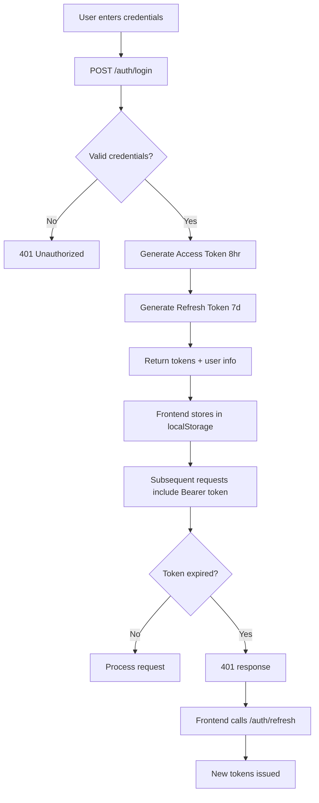

# Retail Demand Forecasting — Complete Learning Document (Volume 3)

> **Sections 11–17: API Documentation, Swagger, Authentication, Logic, Imports, Config, Dependencies**

---

## Section 11 — Complete API Documentation

### 11.1 Authentication Endpoints

#### POST `/api/v1/auth/login`

| Aspect | Detail |
|--------|--------|
| **Purpose** | Authenticate user and get JWT tokens |
| **Auth Required** | No |
| **Content-Type** | `application/x-www-form-urlencoded` (OAuth2 form) |
| **Request Body** | `username=admin&password=Admin@123` |
| **Success Response** | 200: `{access_token, refresh_token, token_type, expires_in, user}` |
| **Error Responses** | 401: Invalid credentials; 403: Account disabled; 429: Rate limited |
| **Rate Limit** | 10/minute per IP |
| **Internal Logic** | Query user → bcrypt verify → update last_login → create tokens |

**Example Request:**
```http
POST /api/v1/auth/login
Content-Type: application/x-www-form-urlencoded

username=admin&password=Admin@123
```

**Example Response:**
```json
{
  "access_token": "eyJhbGciOiJIUzI1NiIsInR5cCI6IkpXVCJ9...",
  "refresh_token": "eyJhbGciOiJIUzI1NiIsInR5cCI6IkpXVCJ9...",
  "token_type": "bearer",
  "expires_in": 28800,
  "user": {
    "id": 1,
    "username": "admin",
    "email": "[email protected]",
    "full_name": "Default Admin",
    "role": "admin",
    "is_active": 1,
    "created_at": "2024-01-01T00:00:00",
    "last_login_at": "2024-07-20T10:30:00"
  }
}
```

#### POST `/api/v1/auth/register`

| Aspect | Detail |
|--------|--------|
| **Purpose** | Create new user account |
| **Auth Required** | No (but admin role blocked unless first user) |
| **Request Body** | `{username, password, email?, full_name?, role?}` |
| **Validation** | Username: 3-64 chars alphanumeric; Password: 8+ chars with letter+digit; Role: admin/analyst/viewer |
| **Success** | 201: UserOut object |
| **Errors** | 403: Admin self-registration blocked; 409: Username/email taken; 422: Validation error |

#### POST `/api/v1/auth/refresh`

| Aspect | Detail |
|--------|--------|
| **Purpose** | Exchange refresh token for new access token |
| **Auth Required** | No (uses refresh_token query param) |
| **Query Param** | `refresh_token=eyJ...` |
| **Success** | 200: New TokenOut with fresh tokens |
| **Errors** | 401: Invalid/expired refresh token |

#### GET `/api/v1/auth/me`

| Aspect | Detail |
|--------|--------|
| **Purpose** | Get current authenticated user info |
| **Auth Required** | Yes (Bearer token) |
| **Success** | 200: UserOut object |
| **Errors** | 401: Not authenticated |

#### POST `/api/v1/auth/change-password`

| Aspect | Detail |
|--------|--------|
| **Purpose** | Change password for current user |
| **Auth Required** | Yes |
| **Query Params** | `old_password=...&new_password=...` |
| **Success** | 200: `{message: "Password updated"}` |
| **Errors** | 400: Old password incorrect; 422: New password too weak |

---

### 11.2 Product Endpoints

#### GET `/api/v1/products`

| Aspect | Detail |
|--------|--------|
| **Purpose** | List all products with pagination |
| **Auth** | Any authenticated user |
| **Query Params** | `skip` (default 0), `limit` (default 100, max 500) |
| **Response** | 200: Array of ProductOut |
| **DB Query** | `SELECT * FROM products OFFSET skip LIMIT limit` |

#### POST `/api/v1/products`

| Aspect | Detail |
|--------|--------|
| **Purpose** | Create new product |
| **Auth** | Admin or Analyst |
| **Request Body** | `{sku, name, category?, unit_cost?, unit_price?, lead_time_days?}` |
| **Response** | 201: ProductOut |
| **Errors** | 409: SKU already exists |

#### GET `/api/v1/products/{product_id}`

| Aspect | Detail |
|--------|--------|
| **Purpose** | Get single product by ID |
| **Auth** | Any authenticated |
| **Response** | 200: ProductOut |
| **Errors** | 404: Product not found |

#### PUT `/api/v1/products/{product_id}`

| Aspect | Detail |
|--------|--------|
| **Purpose** | Update product fields |
| **Auth** | Admin or Analyst |
| **Request Body** | `{name?, category?, unit_cost?, unit_price?, lead_time_days?}` (partial update) |
| **Response** | 200: Updated ProductOut |
| **Errors** | 404: Not found |

#### DELETE `/api/v1/products/{product_id}`

| Aspect | Detail |
|--------|--------|
| **Purpose** | Delete product (cascades to sales, forecasts, inventory) |
| **Auth** | Admin only |
| **Response** | 200: `{message: "Deleted", detail: "Product SKU-001 removed"}` |
| **Errors** | 404: Not found |

---

### 11.3 Sales Endpoints

#### GET `/api/v1/sales`

| Aspect | Detail |
|--------|--------|
| **Purpose** | List sales with optional filters |
| **Auth** | Any authenticated |
| **Query Params** | `product_id?`, `start?` (date), `end?` (date), `skip`, `limit` (max 5000) |
| **Response** | 200: Array of SaleOut, ordered by date descending |

#### POST `/api/v1/sales`

| Aspect | Detail |
|--------|--------|
| **Purpose** | Create single sale record |
| **Auth** | Admin or Analyst |
| **Request Body** | `{product_id, sale_date, quantity, revenue?}` |
| **Response** | 201: SaleOut |
| **Errors** | 404: Product not found |

#### POST `/api/v1/sales/bulk`

| Aspect | Detail |
|--------|--------|
| **Purpose** | Bulk insert multiple sales |
| **Auth** | Admin or Analyst |
| **Request Body** | `{sales: [{product_id, sale_date, quantity, revenue}, ...]}` |
| **Response** | 200: `{message: "Bulk inserted", detail: "150 sales rows"}` |
| **Limit** | Max 200,000 rows |

#### POST `/api/v1/sales/import-csv`

| Aspect | Detail |
|--------|--------|
| **Purpose** | Import sales from CSV file |
| **Auth** | Admin or Analyst |
| **Content-Type** | `multipart/form-data` |
| **CSV Headers** | `sku,sale_date,quantity,revenue` (required: sku, sale_date, quantity) |
| **Response** | 200: `{message: "CSV import done", detail: "inserted=150 skipped=3"}` |
| **Validation** | Content-type check, file size ≤ 10MB, UTF-8 encoding, row cap 200K |

---

### 11.4 Forecast Endpoints

#### POST `/api/v1/forecast/run`

| Aspect | Detail |
|--------|--------|
| **Purpose** | Run single-model forecast |
| **Auth** | Any authenticated |
| **Request Body** | `{product_id: 1, model_name: "prophet", horizon_days: 30}` |
| **Response** | 200: `{product_id, model_name, horizon_days, metrics: {mae, rmse, mape}, total_predicted, forecasts: [{forecast_date, predicted_quantity, lower_bound, upper_bound}, ...]}` |
| **Errors** | 400: Insufficient history / Invalid model; 503: Model not installed; 500: Training failure |
| **Time** | Prophet: ~2-5s; XGBoost: ~1-3s; LSTM: ~30-60s |

#### POST `/api/v1/forecast/compare`

| Aspect | Detail |
|--------|--------|
| **Purpose** | Run all 3 models and compare |
| **Auth** | Admin or Analyst (resource-heavy) |
| **Request Body** | `{product_id: 1, model_name: "prophet", horizon_days: 30}` (model_name ignored) |
| **Response** | 200: `{product_id, horizon_days, results: {prophet: {metrics, total_predicted}, xgboost: {...}, lstm: {...}}, best_model: "xgboost"}` |
| **Logic** | Runs each model, catches errors per model, identifies best by lowest RMSE |

#### GET `/api/v1/forecast/history/{product_id}`

| Aspect | Detail |
|--------|--------|
| **Purpose** | Get stored forecast history for a product |
| **Auth** | Any authenticated |
| **Response** | 200: `{product_id, by_model: {prophet: {metrics, horizon_days, points: [...]}, ...}}` |

#### GET `/api/v1/forecast/seasonal/{product_id}`

| Aspect | Detail |
|--------|--------|
| **Purpose** | Get seasonal analysis for a product |
| **Auth** | Any authenticated |
| **Response** | 200: `{weekly_pattern, monthly_pattern, trend_slope_per_day, trend_direction, peak_weekday, peak_month, avg_daily, max_daily, min_daily, std_daily}` |

#### GET `/api/v1/forecast/models`

| Aspect | Detail |
|--------|--------|
| **Purpose** | List available forecasting models |
| **Auth** | Any authenticated |
| **Response** | 200: `{models: [{name, description}, ...]}` |

---

### 11.5 Inventory Endpoints

#### GET `/api/v1/inventory`

| Aspect | Detail |
|--------|--------|
| **Purpose** | Get inventory status for all products |
| **Auth** | Any authenticated |
| **Response** | 200: Array of `{product_id, sku, name, current_stock, reorder_point, safety_stock, recommended_order_qty, status, notes, lead_time_days, avg_daily_demand}` |

#### GET `/api/v1/inventory/{product_id}`

| Aspect | Detail |
|--------|--------|
| **Purpose** | Get detailed inventory for single product |
| **Auth** | Any authenticated |
| **Response** | 200: InventoryOut object |

#### PUT `/api/v1/inventory/{product_id}`

| Aspect | Detail |
|--------|--------|
| **Purpose** | Update stock level and recompute recommendations |
| **Auth** | Admin or Analyst |
| **Request Body** | `{current_stock: 150.0}` |
| **Response** | 200: Updated InventoryOut with recalculated reorder point and status |

#### POST `/api/v1/inventory/recompute`

| Aspect | Detail |
|--------|--------|
| **Purpose** | Recompute inventory recommendations for all products |
| **Auth** | Admin or Analyst |
| **Response** | 200: `{message: "Inventory recomputed", detail: "20 products updated"}` |

---

### 11.6 Report Endpoints

#### POST `/api/v1/reports/generate`

| Aspect | Detail |
|--------|--------|
| **Purpose** | Generate a report file |
| **Auth** | Admin or Analyst |
| **Request Body** | `{report_type: "forecast|inventory|seasonal", product_id?: 1, format: "json|csv"}` |
| **Response** | 200: `{report_id, format, file_path, size_bytes}` |
| **Logic** | Generates file in `data/reports/`, stores metadata in DB |

#### GET `/api/v1/reports/download/{report_id}`

| Aspect | Detail |
|--------|--------|
| **Purpose** | Download generated report file |
| **Auth** | Any authenticated |
| **Response** | File download (Content-Disposition: attachment) |
| **Security** | Path-traversal check ensures file is within REPORTS_DIR |

#### GET `/api/v1/reports/list`

| Aspect | Detail |
|--------|--------|
| **Purpose** | List generated reports (latest 50) |
| **Auth** | Any authenticated |
| **Response** | 200: Array of `{id, report_type, product_id, format, file_path, created_at}` |

---

### 11.7 Dashboard Endpoints

#### GET `/api/v1/dashboard/summary`

| Aspect | Detail |
|--------|--------|
| **Purpose** | Executive KPIs |
| **Auth** | Any authenticated |
| **Response** | 200: `{total_products, total_sales_records, total_revenue, avg_forecast_30d, low_stock_count, top_products: [...], recent_forecasts: [...]}` |

#### GET `/api/v1/dashboard/revenue-trend`

| Aspect | Detail |
|--------|--------|
| **Purpose** | Daily revenue over trailing N days |
| **Query Params** | `days` (1-365, default 30) |
| **Response** | 200: Array of `{date, revenue}` |

#### GET `/api/v1/dashboard/category-breakdown`

| Aspect | Detail |
|--------|--------|
| **Purpose** | Revenue breakdown by product category |
| **Response** | 200: Array of `{category, revenue}` |

#### GET `/api/v1/dashboard/demand-trend`

| Aspect | Detail |
|--------|--------|
| **Purpose** | Historical sales units + predicted demand |
| **Query Params** | `days` (7-180, default 30) |
| **Response** | 200: `{historical: [{date, units}], predicted: [{date, units}]}` |

---

## Section 12 — Swagger Documentation

### 12.1 What is Swagger?

Swagger (now **OpenAPI**) is a specification for describing REST APIs. It enables:
- Auto-generated interactive documentation
- API testing directly in the browser
- Client code generation
- Schema validation

### 12.2 How FastAPI Generates Swagger

FastAPI automatically generates an OpenAPI 3.0 schema from:
1. **Route decorators** — `@router.get("/products")` → endpoint URL + method
2. **Type annotations** — `product_id: int` → path parameter with int validation
3. **Pydantic models** — `response_model=ProductOut` → response schema
4. **Depends()** — `Depends(get_current_user)` → security requirement
5. **Docstrings** — Function docstrings become endpoint descriptions

### 12.3 Accessing Swagger in This Project

| URL | Description |
|-----|-------------|
| `http://localhost:8000/docs` | Interactive Swagger UI |
| `http://localhost:8000/redoc` | ReDoc (read-only documentation) |
| `http://localhost:8000/openapi.json` | Raw OpenAPI schema (JSON) |

### 12.4 Custom Swagger Implementation

This project uses **custom docs routes** (not FastAPI's built-in) because:
- Browser dark-mode makes default Swagger text invisible
- Custom CSS forces light background regardless of browser theme
- Custom CSP allows CDN-loaded Swagger UI scripts

**Key code in `main.py`:**
```python
app = FastAPI(docs_url=None, redoc_url=None)  # Disable built-in

@app.get("/docs")
async def custom_swagger_docs():
    return HTMLResponse(f"""
    <html>
    <head>
    <link rel="stylesheet" href="https://cdn.jsdelivr.net/npm/swagger-ui-dist@5/swagger-ui.css" />
    <style>{SWAGGER_CSS}</style>  <!-- Forces light mode -->
    </head>
    <body>
    <div id="swagger-ui"></div>
    <script src="https://cdn.jsdelivr.net/npm/swagger-ui-dist@5/swagger-ui-bundle.js"></script>
    <script>SwaggerUIBundle({url: '/openapi.json', dom_id: '#swagger-ui'})</script>
    </body>
    </html>""")
```

### 12.5 Testing APIs via Swagger

1. Open `http://localhost:8000/docs`
2. Click **Authorize** button (top right)
3. Enter: Username: `admin`, Password: `Admin@123`
4. Click **Authorize** → Swagger stores the token for all requests
5. Expand any endpoint → Click **Try it out** → Fill parameters → Click **Execute**
6. View response body, status code, headers

### 12.6 How Schemas Appear in Swagger

Every Pydantic model in `schemas.py` generates a JSON Schema in the Swagger UI:
- `UserCreate` → shows required fields, validation rules, examples
- `ForecastRequest` → shows regex pattern for model_name, min/max for horizon_days
- `TokenOut` → shows the complete response structure

---

## Section 13 — Authentication

### 13.1 Authentication Flow Overview



### 13.2 JWT Token Structure

A JWT has 3 parts separated by dots: `header.payload.signature`

**Header:**
```json
{"alg": "HS256", "typ": "JWT"}
```

**Payload (Access Token):**
```json
{
  "sub": "1",           // User ID
  "type": "access",    // Token type
  "iat": 1721470800,   // Issued at (Unix timestamp)
  "exp": 1721499600    // Expires at (8 hours later)
}
```

**Payload (Refresh Token):**
```json
{
  "sub": "1",
  "type": "refresh",
  "iat": 1721470800,
  "exp": 1722075600    // Expires at (7 days later)
}
```

### 13.3 Password Security

**Hashing Process:**
1. User provides plaintext password: `Admin@123`
2. bcrypt generates random 16-byte salt
3. bcrypt runs 2^12 = 4096 iterations of Blowfish cipher
4. Result: `$2b$12$LJ3/...` (60-char hash)
5. Hash stored in database (plaintext NEVER stored)

**Verification Process:**
1. User provides password during login
2. bcrypt extracts salt from stored hash
3. Re-hashes provided password with same salt
4. Compares hashes (constant-time to prevent timing attacks)

### 13.4 Role-Based Access Control (RBAC)

| Role | Can Do | Cannot Do |
|------|--------|-----------|
| **admin** | Everything | Nothing restricted |
| **analyst** | Run forecasts, generate reports, manage products/sales | Delete products, create admin users |
| **viewer** | View dashboard, products, inventory, sales | Run forecasts, generate reports, modify data |

**Implementation:**
```python
# Any authenticated user
_: models.User = Depends(get_current_user)

# Admin or Analyst only
_: models.User = Depends(require_role("admin", "analyst"))

# Admin only
_: models.User = Depends(get_current_active_admin)
```

### 13.5 Security Best Practices Implemented

1. **Generic error messages** — Login failures say "Invalid username or password" (doesn't reveal which is wrong)
2. **Constant-time comparison** — bcrypt.verify uses constant-time comparison to prevent timing attacks
3. **Token type validation** — Access tokens can't be used as refresh tokens and vice versa
4. **Rate limiting** — 10 attempts/minute for auth endpoints (brute-force protection)
5. **Password strength requirements** — Must contain letter + digit, minimum 8 characters
6. **Admin self-registration blocked** — After first admin, new admin accounts need existing admin
7. **Account disable** — `is_active` flag can lock out users without deleting them

---

## Section 14 — Complete Logic Explanation

### 14.1 Forecasting Logic

**Prophet Model:**
1. Load sales → create DataFrame (ds, y)
2. Split: 80% train, 20% test
3. Configure: additive model, weekly seasonality ON, yearly only if 365+ days
4. Fit model on training data
5. Predict on full dataset → compute MAE, RMSE, MAPE
6. Generate future dates (horizon_days) → predict → clip negatives to 0

**XGBoost Model:**
1. Load sales → create DataFrame
2. Engineer 16 features (calendar + lag + rolling statistics)
3. Split: last N rows for test (N = max(horizon, 7), capped at 25%)
4. Train XGBRegressor (500 trees, lr=0.05, max_depth=6)
5. Predict test set → compute metrics
6. Recursive forecast: for each future day, predict → append to history → rebuild features → repeat
7. Confidence: ±1.96 × residual_std

**LSTM Model:**
1. Load sales → Z-score normalize: (x - mean) / std
2. Create sliding windows of length 30 (seq_length)
3. Split: 85% train, 15% validation
4. Build model: LSTM(50) → Dropout(0.2) → Dense(25) → Dense(1)
5. Train: Adam optimizer, MSE loss, EarlyStopping(patience=3)
6. Predict all windows → denormalize → compute metrics
7. Recursive forecast: feed last window → predict → append → slide window → repeat

### 14.2 Inventory Optimization Logic

**Safety Stock Calculation:**
```
Safety Stock = Z × σ_daily × √(lead_time_days)
```
- Z = 1.65 (95th percentile of normal distribution)
- σ_daily = standard deviation of daily sales quantity
- √(lead_time) = accounts for variability accumulation over lead time

**Reorder Point:**
```
Reorder Point = (avg_daily_demand × lead_time_days) + safety_stock
```
- avg_daily × lead = expected demand while waiting for delivery
- + safety_stock = buffer for demand spikes

**Recommended Order Quantity:**
```
Recommended = max(0, expected_demand_7days + safety_stock - current_stock)
```
- Ensures you have enough for 7 days + safety buffer

### 14.3 Async Programming in This Project

FastAPI supports both sync and async handlers:
- **Sync handlers** (this project): `def list_products(...)` — run in thread pool
- **Async handlers**: `async def import_csv(...)` — for file I/O operations

The CSV import endpoint uses `async def` because `await file.read()` is an I/O operation.

### 14.4 Error Handling Strategy

```
Router Layer:  try/except → HTTPException (user-facing)
Service Layer: raise ValueError → caught by router
Model Layer:   raise RuntimeError → caught by router as 503
Uncaught:      Generic handler → 500 + log + request_id
```

---

## Section 15 — Imports Explanation

### 15.1 Python Standard Library

| Import | Purpose in This Project |
|--------|------------------------|
| `os` | Environment variables, TF log suppression |
| `sys` | System path, exit codes |
| `csv` | CSV reading/writing for reports and imports |
| `io` | StringIO for in-memory CSV parsing |
| `json` | JSON serialization for reports |
| `math` | `sqrt()` for safety stock formula |
| `uuid` | Generate request IDs |
| `secrets` | Generate cryptographic SECRET_KEY |
| `logging` | Application logging |
| `datetime` | Date/time handling |
| `pathlib` | File path manipulation |
| `re` | Regular expressions for validation |
| `functools` | `lru_cache` for settings singleton |
| `contextlib` | `asynccontextmanager` for lifespan |
| `typing` | Type hints (List, Dict, Optional, Tuple) |

### 15.2 Third-Party Libraries

| Import | Library | Purpose |
|--------|---------|---------|
| `fastapi` | FastAPI | Web framework, routing, dependencies |
| `uvicorn` | Uvicorn | ASGI server |
| `sqlalchemy` | SQLAlchemy | ORM, database engine, sessions |
| `pydantic` | Pydantic | Data validation, schemas |
| `pydantic_settings` | pydantic-settings | Environment-based configuration |
| `jose` | python-jose | JWT encode/decode |
| `passlib` | passlib | Password hashing (bcrypt wrapper) |
| `slowapi` | slowapi | Rate limiting |
| `numpy` | NumPy | Numerical operations, metrics |
| `pandas` | Pandas | DataFrame operations, time series |
| `prophet` | Prophet | Time series forecasting |
| `xgboost` | XGBoost | Gradient boosting |
| `tensorflow.keras` | TensorFlow | LSTM neural network |
| `axios` | Axios (JS) | HTTP client |
| `react` | React | UI library |
| `react-router-dom` | React Router | Client-side routing |
| `recharts` | Recharts | Charts/graphs |
| `lucide-react` | Lucide | Icons |

---

## Section 16 — Configuration Files

### 16.1 `.env.example` — Environment Template

```env
# Application
APP_NAME=Retail Demand Forecasting System
APP_VERSION=1.1.0
DEBUG=false
API_V1_PREFIX=/api/v1

# Database
DATABASE_URL=sqlite:///data/retail_forecast.db
DB_ECHO=false

# Security
SECRET_KEY=your-secret-key-change-in-production
JWT_ALGORITHM=HS256
ACCESS_TOKEN_EXPIRE_MINUTES=480
REFRESH_TOKEN_EXPIRE_MINUTES=10080
BCRYPT_ROUNDS=12

# CORS
CORS_ORIGINS=http://localhost:5173,http://localhost:3000

# Rate Limiting
RATE_LIMIT_DEFAULT=120/minute
RATE_LIMIT_FORECAST=10/minute
RATE_LIMIT_AUTH=10/minute

# Forecasting
FORECAST_HORIZON_DAYS=30
PROPHET_INTERVAL_WIDTH=0.95
XGB_N_ESTIMATORS=500
LSTM_EPOCHS=20
LSTM_SEQUENCE_LENGTH=30

# Inventory
SAFETY_STOCK_DAYS=7
REORDER_LEAD_DAYS=5
SAFETY_STOCK_Z=1.65

# Upload Limits
MAX_UPLOAD_BYTES=10485760
MAX_CSV_ROWS=200000
```

### 16.2 `requirements.txt` — Python Dependencies

```
fastapi==0.115.0
uvicorn[standard]==0.30.6
sqlalchemy==2.0.34
pydantic==2.9.2
pydantic-settings==2.5.2
python-dotenv==1.0.1
python-multipart==0.0.9
python-jose[cryptography]==3.3.0
passlib[bcrypt]==1.7.4
bcrypt==4.0.1
slowapi==0.1.9
numpy==1.26.4
pandas==2.2.2
scikit-learn==1.5.1
prophet==1.1.5
cmdstanpy==1.2.4
xgboost==2.1.1
tensorflow==2.16.1
psycopg2-binary==2.9.9
pytest==8.3.2
httpx==0.27.2
email-validator==2.2.0
```

### 16.3 `package.json` — Frontend Dependencies

```json
{
  "name": "retail-forecast-ui",
  "private": true,
  "version": "1.1.0",
  "type": "module",
  "scripts": {
    "dev": "vite",
    "build": "vite build",
    "preview": "vite preview"
  },
  "dependencies": {
    "axios": "^1.7.2",
    "lucide-react": "^0.400.0",
    "react": "^18.3.1",
    "react-dom": "^18.3.1",
    "react-router-dom": "^6.24.1",
    "recharts": "^2.12.7"
  },
  "devDependencies": {
    "@vitejs/plugin-react": "^4.3.1",
    "vite": "^5.3.3"
  }
}
```

### 16.4 `vite.config.js` — Build Configuration

```javascript
import { defineConfig } from 'vite'
import react from '@vitejs/plugin-react'

export default defineConfig({
  plugins: [react()],
  server: {
    proxy: {
      '/api/v1': {
        target: 'http://localhost:8000',
        changeOrigin: true,
      }
    }
  }
})
```

**What this does:**
- `plugins: [react()]` — enables JSX compilation and Fast Refresh
- `proxy` — forwards `/api/v1/*` requests from dev server (5173) to backend (8000)
- `changeOrigin: true` — changes the Origin header to match the target

### 16.5 `.gitignore` — Git Exclusions

Key entries:
- `.venv/` — virtual environment (large, platform-specific)
- `__pycache__/` — Python bytecode cache
- `node_modules/` — npm packages (large)
- `*.db` — database files (runtime data)
- `.env` — secrets (never commit!)
- `data/reports/*` — generated files
- `data/models/*` — saved ML models

---

## Section 17 — Complete Dependency Explanation

### 17.1 Python Dependencies

| Package | Version | Purpose | Used In |
|---------|---------|---------|---------|
| fastapi | 0.115.0 | Web framework | main.py, all routers |
| uvicorn | 0.30.6 | ASGI server | run.py |
| sqlalchemy | 2.0.34 | ORM + database engine | database.py, models.py, all services |
| pydantic | 2.9.2 | Data validation | schemas.py |
| pydantic-settings | 2.5.2 | Config from .env | config.py |
| python-dotenv | 1.0.1 | .env file loading | config.py (via pydantic-settings) |
| python-multipart | 0.0.9 | Form data parsing (file upload) | sales router (CSV import) |
| python-jose | 3.3.0 | JWT encode/decode | auth.py |
| passlib | 1.7.4 | Password hashing | auth.py |
| bcrypt | 4.0.1 | bcrypt backend for passlib | auth.py (indirect) |
| slowapi | 0.1.9 | Rate limiting | main.py |
| numpy | 1.26.4 | Numerical computation | all ML services, metrics |
| pandas | 2.2.2 | DataFrames, time series | all ML services, seasonal |
| scikit-learn | 1.5.1 | ML utilities (XGBoost dependency) | xgboost_service |
| prophet | 1.1.5 | Time series forecasting | prophet_service |
| cmdstanpy | 1.2.4 | Stan backend for Prophet | prophet_service (indirect) |
| xgboost | 2.1.1 | Gradient boosting | xgboost_service |
| tensorflow | 2.16.1 | Deep learning (LSTM) | lstm_service |
| psycopg2-binary | 2.9.9 | PostgreSQL driver | database.py (production) |
| pytest | 8.3.2 | Testing framework | tests/ |
| httpx | 0.27.2 | Async HTTP client for testing | tests/ |
| email-validator | 2.2.0 | Email validation | schemas.py (EmailStr) |

### 17.2 Frontend Dependencies

| Package | Version | Purpose | Used In |
|---------|---------|---------|---------|
| react | 18.3.1 | UI library | All .jsx files |
| react-dom | 18.3.1 | DOM rendering | main.jsx |
| react-router-dom | 6.24.1 | Client-side routing | App.jsx, Sidebar |
| axios | 1.7.2 | HTTP client | client.js |
| recharts | 2.12.7 | Charts and graphs | Dashboard, Forecast, Seasonal |
| lucide-react | 0.400.0 | SVG icons | Sidebar, Topbar, pages |
| vite | 5.3.3 | Build tool + dev server | vite.config.js |
| @vitejs/plugin-react | 4.3.1 | React support for Vite | vite.config.js |

### Learning Notes — Sections 11-17

**Key Takeaways:**
- All API endpoints require JWT authentication except login and register
- Swagger UI is available at /docs with forced light mode
- JWT contains user ID (sub), type (access/refresh), and expiration
- bcrypt with 12 rounds takes ~250ms to hash (intentionally slow)
- Safety Stock = Z × σ × √(lead_time) is the key inventory formula
- Vite proxy eliminates CORS issues during development

**Interview Tips:**
- "How does JWT work?" → Stateless tokens with header.payload.signature signed by server secret
- "Why bcrypt?" → Intentionally slow (adjustable work factor), includes salt, time-tested
- "What is RBAC?" → Role-Based Access Control: users have roles, roles have permissions
- "Why Vite proxy?" → Avoids CORS during development; frontend and backend on same origin

