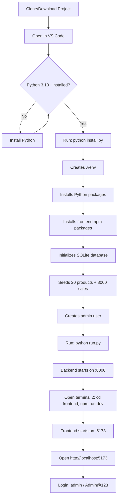
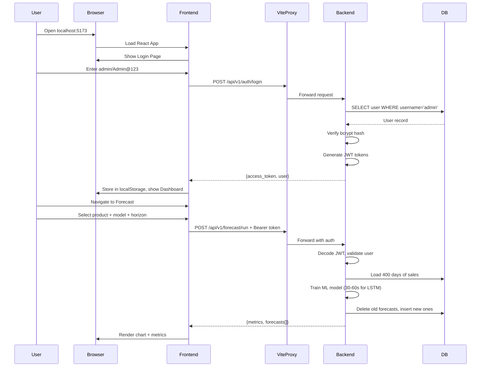

# Retail Demand Forecasting — Complete Learning Document (Volume 4)

> **Sections 18–22: Workflow, Debugging, Performance, Security, Deployment**

---

## Section 18 — Complete Project Workflow

### 18.1 Developer Setup Flow



### 18.2 Step-by-Step Workflow

**Step 1: Clone the project**
```bash
git clone https://github.com/karandhaodiyal28-hash/retail_demand_forecasting.git
cd retail_demand_forecasting
```

**Step 2: Run installer**
```bash
python install.py
```
This automatically:
- Creates Python virtual environment in `.venv/`
- Installs all packages from `requirements.txt`
- Runs `npm install` in `frontend/`
- Executes `python -m backend.seed_data` to populate database

**Step 3: Activate virtual environment**
```powershell
.\.venv\Scripts\Activate.ps1    # Windows PowerShell
source .venv/bin/activate        # Linux/macOS
```

**Step 4: Start backend**
```bash
python run.py
# OR directly:
uvicorn backend.main:app --reload --port 8000
```

**Step 5: Start frontend (new terminal)**
```bash
cd frontend
npm run dev
```

**Step 6: Use the application**
1. Open `http://localhost:5173` in browser
2. Login with `admin` / `Admin@123`
3. Navigate to Forecast → select product → run prediction
4. Check Inventory for reorder recommendations
5. Generate reports for download

### 18.3 Data Flow: From Login to Forecast



---

## Section 19 — Debugging Guide

### 19.1 Common Errors and Solutions

#### Error: `ModuleNotFoundError: No module named 'backend'`
**Cause:** Running from wrong directory or venv not activated.
**Solution:** 
```bash
cd retail_demand_forecasting  # Must be in project root
.\.venv\Scripts\Activate.ps1
python run.py
```

#### Error: `ImportError: cannot import name 'Prophet' from 'prophet'`
**Cause:** Prophet not installed or cmdstanpy version conflict.
**Solution:**
```bash
pip install prophet==1.1.5 cmdstanpy==1.2.4
```
On Windows, cmdstanpy >= 1.3.0 breaks Prophet 1.1.5.

#### Error: `CORS error: Access-Control-Allow-Origin`
**Cause:** Frontend running on a port not in CORS_ORIGINS.
**Solution:** Add your port to `.env`:
```env
CORS_ORIGINS=http://localhost:5173,http://localhost:3000
```

#### Error: `401 Unauthorized` on API calls
**Cause:** Token expired or not being sent.
**Solution:** 
1. Check localStorage for `retail_forecast_auth` key
2. Ensure Axios interceptor is attaching Bearer token
3. Try logging out and back in

#### Error: `422 Validation Error` on POST requests
**Cause:** Request body doesn't match Pydantic schema.
**Solution:** Check Swagger UI (`/docs`) for exact field requirements.

#### Error: `sqlite3.OperationalError: database is locked`
**Cause:** Multiple concurrent writes to SQLite.
**Solution:** Use PostgreSQL for production, or ensure single-writer access.

#### Error: `Swagger UI shows blank page`
**Cause:** CSP blocking CDN scripts.
**Solution:** Custom docs routes with relaxed CSP (already implemented in v1.1.0).

#### Error: `429 Too Many Requests`
**Cause:** Rate limiter triggered.
**Solution:** Wait 1 minute, or adjust `RATE_LIMIT_*` settings in `.env`.

#### Error: `LSTM forecast takes forever`
**Cause:** TensorFlow running on CPU without GPU.
**Solution:** Normal behavior (30-60s on CPU). LSTM_EPOCHS=20 is the setting to reduce.

#### Error: Report download returns 401
**Cause:** Using `<a href>` for download (no JWT sent).
**Solution:** Already fixed in v1.1.0 — uses blob download with Authorization header.

### 19.2 Debugging Tools

| Tool | Purpose | How to Use |
|------|---------|-----------|
| Swagger UI | Test API endpoints | http://localhost:8000/docs |
| Browser DevTools (Network tab) | Inspect requests/responses | F12 → Network |
| Browser DevTools (Console) | View JavaScript errors | F12 → Console |
| Uvicorn logs | Backend request logging | Terminal running backend |
| React DevTools | Inspect component state | Chrome extension |
| SQLite Browser | View database tables | DB Browser for SQLite app |

### 19.3 Debugging Checklist

1. Is the virtual environment activated? (check terminal prompt)
2. Is the backend running? (check http://localhost:8000/health)
3. Is the frontend running? (check http://localhost:5173)
4. Are you logged in? (check localStorage in DevTools)
5. Is the JWT expired? (decode at jwt.io)
6. Does Swagger show the endpoint? (http://localhost:8000/docs)
7. What does the backend log say? (check terminal)
8. Is the database populated? (check product count)

---

## Section 20 — Performance

### 20.1 Time Complexity Analysis

| Operation | Time Complexity | Explanation |
|-----------|----------------|-------------|
| User lookup (by username) | O(log n) | Indexed column |
| List products | O(n) with limit | Linear scan up to limit |
| Sales query (by product + date range) | O(log n + k) | Composite index + k results |
| Prophet training | O(n × iterations) | Linear in data points |
| XGBoost training | O(n × d × trees) | n=rows, d=features, trees=500 |
| LSTM training | O(epochs × n × seq_len) | Most expensive operation |
| Inventory computation | O(n) | Single pass over sales data |
| Safety stock calc | O(1) | Fixed-time formula |

### 20.2 Space Complexity

| Component | Memory Usage | Notes |
|-----------|-------------|-------|
| SQLite DB | ~5-50 MB | Depends on data volume |
| Prophet model | ~100-200 MB RAM | During training only |
| XGBoost model | ~50-100 MB RAM | During training |
| TensorFlow/LSTM | ~200-500 MB RAM | GPU memory if available |
| React frontend | ~10-30 MB browser | Component tree + state |

### 20.3 Optimization Techniques Used

**Database Optimizations:**
- Composite indexes on frequently-queried column pairs
- Pagination (OFFSET/LIMIT) to prevent loading all records
- `pool_pre_ping=True` to recycle stale connections

**API Optimizations:**
- Rate limiting (prevents abuse from consuming resources)
- Body size limit (prevents memory exhaustion from large uploads)
- Response clamping (limit=max 500 products, max 5000 sales)

**Frontend Optimizations:**
- Lazy state updates (only re-render on data change)
- Conditional rendering (don't render charts with no data)
- Vite code splitting (loads only needed JS per route)

**ML Optimizations:**
- EarlyStopping for LSTM (stops training when validation loss plateaus)
- Recursive forecasting (avoids re-training for each future day)
- Z-score normalization (helps LSTM converge faster)

### 20.4 Bottlenecks and Solutions

| Bottleneck | Impact | Solution |
|------------|--------|----------|
| LSTM training on CPU | 30-60s per forecast | Use GPU or reduce LSTM_EPOCHS |
| SQLite write locking | Concurrent requests block | Switch to PostgreSQL |
| Large CSV imports | Memory spike for 200K rows | Streaming/chunked processing |
| All-products inventory scan | Slow for 1000+ products | Add caching layer |

---

## Section 21 — Security

### 21.1 Vulnerabilities Prevented

| Attack | Prevention |
|--------|-----------|
| **SQL Injection** | SQLAlchemy ORM (parameterized queries, never raw SQL) |
| **XSS (Cross-Site Scripting)** | React auto-escapes output; CSP script-src 'self' |
| **CSRF (Cross-Site Request Forgery)** | JWT in Authorization header (not cookies) |
| **Brute Force Login** | Rate limiting: 10/minute on /auth endpoints |
| **Password Cracking** | bcrypt with 12 rounds (~250ms per attempt) |
| **Token Theft** | Short expiry (8hrs access, 7d refresh) |
| **Information Leakage** | Generic error messages; no stack traces in responses |
| **Path Traversal** | `resolve().relative_to(REPORTS_DIR)` check on downloads |
| **DoS (Denial of Service)** | Body size limit (10MB), CSV row cap (200K) |
| **Clickjacking** | X-Frame-Options: DENY |
| **MIME Sniffing** | X-Content-Type-Options: nosniff |
| **Host Header Attacks** | TrustedHostMiddleware |
| **Unrestricted File Upload** | Content-type validation, size check, encoding check |
| **User Enumeration** | Same error for wrong username vs wrong password |
| **Privilege Escalation** | Role checks on every write endpoint |

### 21.2 Security Headers Applied

```
X-Content-Type-Options: nosniff
X-Frame-Options: DENY
Referrer-Policy: strict-origin-when-cross-origin
Permissions-Policy: geolocation=(), microphone=(), camera=()
X-XSS-Protection: 1; mode=block
Strict-Transport-Security: max-age=63072000; includeSubDomains
Content-Security-Policy: default-src 'self'; img-src 'self' data:; style-src 'self' 'unsafe-inline' https://fonts.googleapis.com; font-src 'self' https://fonts.gstatic.com; script-src 'self'; connect-src 'self'; frame-ancestors 'none'; base-uri 'self';
```

### 21.3 Rate Limiting Configuration

| Endpoint Group | Limit | Purpose |
|---------------|-------|---------|
| Default (all endpoints) | 120/minute per IP | General abuse prevention |
| Auth (login/register) | 10/minute per IP | Brute-force protection |
| Forecast (run/compare) | 10/minute per IP | Resource protection (LSTM is expensive) |

### 21.4 Input Validation Summary

| Input | Validation |
|-------|-----------|
| Username | 3-64 chars, regex `[A-Za-z0-9_.-]` |
| Password | 8-128 chars, must have letter + digit |
| SKU | 1-64 chars, regex `[A-Za-z0-9._-]` |
| Product prices | >= 0 (non-negative) |
| Lead time | 0-365 days |
| Horizon days | 1-365 |
| Model name | Must match `prophet|xgboost|lstm` |
| Report type | Must match `forecast|inventory|seasonal` |
| CSV upload | ≤ 10MB, text/csv content-type, UTF-8, ≤ 200K rows |
| Query params (skip/limit) | Clamped to safe ranges |

### 21.5 Environment Variable Security

| Practice | Implementation |
|----------|---------------|
| Secrets in .env (not code) | `SECRET_KEY` loaded from environment |
| .env not committed | Listed in `.gitignore` |
| Template provided | `.env.example` shows structure without real values |
| Auto-generation fallback | If SECRET_KEY not set, generates random 64-byte token |

---

## Section 22 — Deployment

### 22.1 Local Development (Windows)

```powershell
# Already covered in Section 18
python install.py
python run.py
# Frontend: cd frontend; npm run dev
```

### 22.2 Local Development (Linux/macOS)

```bash
python3 install.py
source .venv/bin/activate
python run.py
# Frontend: cd frontend && npm run dev
```

### 22.3 Docker Deployment

**Dockerfile (Backend):**
```dockerfile
FROM python:3.12-slim
WORKDIR /app
COPY requirements.txt .
RUN pip install --no-cache-dir -r requirements.txt
COPY backend/ ./backend/
COPY data/ ./data/
COPY .env .
EXPOSE 8000
CMD ["uvicorn", "backend.main:app", "--host", "0.0.0.0", "--port", "8000"]
```

**Dockerfile (Frontend):**
```dockerfile
FROM node:18-alpine
WORKDIR /app
COPY frontend/package*.json ./
RUN npm ci
COPY frontend/ ./
RUN npm run build
FROM nginx:alpine
COPY --from=0 /app/dist /usr/share/nginx/html
EXPOSE 80
```

**docker-compose.yml:**
```yaml
version: '3.8'
services:
  backend:
    build: .
    ports: ["8000:8000"]
    environment:
      - DATABASE_URL=postgresql://user:pass@db:5432/retail
      - SECRET_KEY=your-production-secret
    depends_on: [db]
  frontend:
    build:
      context: ./frontend
    ports: ["80:80"]
  db:
    image: postgres:15
    environment:
      POSTGRES_USER: user
      POSTGRES_PASSWORD: pass
      POSTGRES_DB: retail
    volumes: ["pgdata:/var/lib/postgresql/data"]
volumes:
  pgdata:
```

### 22.4 Render Deployment

1. Push code to GitHub
2. Create new Web Service on render.com
3. Set build command: `pip install -r requirements.txt`
4. Set start command: `uvicorn backend.main:app --host 0.0.0.0 --port $PORT`
5. Add environment variables (SECRET_KEY, DATABASE_URL with PostgreSQL)
6. Deploy frontend as Static Site (build command: `cd frontend && npm run build`)

### 22.5 Railway Deployment

1. Connect GitHub repo to Railway
2. Railway auto-detects Python + requirements.txt
3. Add PostgreSQL addon for database
4. Set env vars: `SECRET_KEY`, `DATABASE_URL` (from Railway Postgres)
5. Start command: `uvicorn backend.main:app --host 0.0.0.0 --port $PORT`

### 22.6 AWS Deployment

**Architecture:**
- EC2 or ECS for backend
- S3 + CloudFront for frontend
- RDS PostgreSQL for database
- Secrets Manager for SECRET_KEY

**Steps:**
1. Build frontend: `npm run build` → upload `dist/` to S3
2. Create RDS PostgreSQL instance
3. Deploy backend to EC2/ECS with `DATABASE_URL` pointing to RDS
4. Configure ALB (Application Load Balancer) for HTTPS
5. Set up Route53 for custom domain

### 22.7 Vercel + Railway (Recommended Split)

- **Frontend** → Vercel (free tier, auto-deploy from GitHub)
- **Backend** → Railway (free tier, auto-deploy, PostgreSQL addon)
- Update `VITE_API_BASE` to point to Railway backend URL
- Update `CORS_ORIGINS` to include Vercel domain

### 22.8 Production Checklist

| Item | Status | Notes |
|------|--------|-------|
| Change SECRET_KEY | Required | Use `openssl rand -hex 64` |
| Change admin password | Required | POST /auth/change-password |
| Use PostgreSQL | Recommended | Set DATABASE_URL |
| Enable HTTPS | Required | Use reverse proxy (nginx) or cloud LB |
| Set DEBUG=false | Required | Prevents debug info leakage |
| Tighten CORS_ORIGINS | Required | Only allow production frontend domain |
| Tighten TrustedHost | Recommended | Set allowed_hosts to production domain |
| Add Gunicorn | Recommended | Multi-worker: `gunicorn -w 4 -k uvicorn.workers.UvicornWorker` |
| Set up logging | Recommended | Ship logs to CloudWatch/Datadog |
| Database backups | Required | Automated daily backups |
| Monitor uptime | Recommended | Use UptimeRobot or similar |

### Learning Notes — Sections 18-22

**Key Takeaways:**
- One-command setup (`python install.py`) makes onboarding fast
- SQLite → PostgreSQL switch requires only changing DATABASE_URL
- Security is layered: headers + rate limiting + auth + validation + path checks
- LSTM is the performance bottleneck (30-60s on CPU)
- Docker compose is the cleanest production deployment option

**Common Mistakes:**
- Deploying with DEBUG=true (leaks internal errors)
- Not changing SECRET_KEY (default is auto-generated per restart = tokens invalidated)
- Forgetting to update CORS_ORIGINS for production domain
- Running SQLite in production (write locking under load)

**Interview Tips:**
- "How would you scale this?" → PostgreSQL, Gunicorn multi-worker, Redis caching, separate ML worker
- "What's the biggest security risk?" → SECRET_KEY exposure; mitigate with env vars + Secrets Manager
- "How do you handle long-running ML tasks?" → Background workers (Celery/RQ) or async streaming

