# Retail Demand Forecasting System — Complete Learning Document

> **From Scratch to Finish: A Complete Developer's Guide**
>
> Author: Karan Dhaodiyal | Program: MCA | Version: 1.1.0 | License: MIT

---

## Document Structure

This documentation is split into 5 volumes for readability:

| Volume | File | Sections |
|--------|------|----------|
| **Volume 1** | `scratch to finish.md` (this file) | 1–3: Overview, Architecture, Tech Stack |
| **Volume 2** | `scratch to finish - Volume 2.md` | 4–10: Folder Structure, Files, Code, Execution Flow, Frontend, Backend, Database |
| **Volume 3** | `scratch to finish - Volume 3.md` | 11–17: API Docs, Swagger, Authentication, Logic, Imports, Config, Dependencies |
| **Volume 4** | `scratch to finish - Volume 4.md` | 18–22: Workflow, Debugging, Performance, Security, Deployment |
| **Volume 5** | `scratch to finish - Volume 5.md` | 23–26: Source Code Map, Glossary, 65+ Interview Questions, Learning Notes |

---

## Table of Contents (All Volumes)

- [Section 1 — Project Overview](#section-1--project-overview)
- [Section 2 — Complete Project Architecture](#section-2--complete-project-architecture)
- [Section 3 — Technology Stack](#section-3--technology-stack)
- Section 4 — Complete Folder Structure (Volume 2)
- Section 5 — Every File Explanation (Volume 2)
- [Section 6 — Line by Line Code Explanation](#section-6--line-by-line-code-explanation)
- [Section 7 — Execution Flow](#section-7--execution-flow)
- [Section 8 — Frontend](#section-8--frontend)
- [Section 9 — Backend](#section-9--backend)
- [Section 10 — Database](#section-10--database)
- [Section 11 — Complete API Documentation](#section-11--complete-api-documentation)
- [Section 12 — Swagger Documentation](#section-12--swagger-documentation)
- [Section 13 — Authentication](#section-13--authentication)
- [Section 14 — Complete Logic Explanation](#section-14--complete-logic-explanation)
- [Section 15 — Imports](#section-15--imports)
- [Section 16 — Configuration Files](#section-16--configuration-files)
- [Section 17 — Complete Dependency Explanation](#section-17--complete-dependency-explanation)
- [Section 18 — Complete Project Workflow](#section-18--complete-project-workflow)
- [Section 19 — Debugging Guide](#section-19--debugging-guide)
- [Section 20 — Performance](#section-20--performance)
- [Section 21 — Security](#section-21--security)
- [Section 22 — Deployment](#section-22--deployment)
- [Section 23 — Complete Source Code Map](#section-23--complete-source-code-map)
- [Section 24 — Glossary](#section-24--glossary)
- [Section 25 — Interview Questions](#section-25--interview-questions)
- [Section 26 — Learning Notes](#section-26--learning-notes)

---

## Section 1 — Project Overview

### 1.1 Project Name

**Retail Demand Forecasting System**

### 1.2 Purpose

This project is an AI/ML-powered demand forecasting and inventory optimization platform designed for the **Retail & Supply Chain** industry.

**In Simple Words (Beginner-Friendly):**  
Imagine you own a grocery store. Every day, you sell rice, flour, oil, snacks, etc. You need to know:
- How much of each product will customers buy next week? Next month?
- When should you reorder products so you never run out?
- Which products are selling more on weekends vs weekdays?

This software answers all these questions using **Artificial Intelligence and Machine Learning**. It looks at your past sales data, finds patterns (like "rice sells more on weekends"), and predicts future demand. It also tells you exactly when to reorder and how much to order.

**Technical Explanation:**  
The system implements three distinct time-series forecasting models (Prophet, XGBoost, LSTM neural network) exposed through a RESTful API, coupled with inventory optimization algorithms (safety stock calculation using Z-score statistical methods) and a React-based business intelligence dashboard for visualization and decision-making.

### 1.3 Real-World Problem It Solves

| Problem | How This System Solves It |
|---------|--------------------------|
| **Stockouts** — Running out of popular products, losing sales | Predicts demand in advance, recommends when to reorder |
| **Overstocking** — Buying too much, wasting money on storage | Calculates optimal order quantities based on statistical models |
| **Manual Guessing** — Store managers estimating demand by intuition | Replaces guesswork with data-driven ML predictions |
| **Seasonal Blindspots** — Not knowing peak demand periods | Analyzes weekly/monthly patterns, identifies peak days |
| **No Visibility** — No dashboard to see business performance | Provides executive BI dashboard with KPIs, charts, and exports |

### 1.4 Why This Project Was Built

1. **Academic Purpose** — Built as an MCA (Master of Computer Applications) project to demonstrate full-stack development + ML integration.
2. **Industry Relevance** — Retail demand forecasting is a real problem faced by every retail business worldwide.
3. **End-to-End Demonstration** — Shows how to build a production-ready system combining frontend, backend, database, ML, security, and deployment.
4. **Portfolio Project** — Demonstrates skills in Python, FastAPI, React, TensorFlow, XGBoost, Prophet, JWT authentication, and modern web development.

### 1.5 Target Users

| User Role | Description | Access Level |
|-----------|-------------|--------------|
| **Admin** | Store owner / IT administrator | Full access: create users, delete products, generate reports |
| **Analyst** | Data analyst / inventory manager | Run forecasts, view inventory, generate reports, add sales |
| **Viewer** | Store staff / junior employees | View-only: see dashboard, products, inventory status |

### 1.6 Main Features

1. **Product Demand Prediction** — Forecast daily demand for any SKU over a 1–365 day horizon using Prophet, XGBoost, or LSTM.
2. **Inventory Optimization** — Auto-compute reorder points, safety stock (Z=1.65 for 95% service level), and recommended order quantities.
3. **Seasonal Analysis** — Detect weekly/monthly patterns, trend direction, and peak demand periods.
4. **Sales Forecasting** — Multi-model comparison with MAE/RMSE/MAPE evaluation metrics.
5. **Executive BI Dashboard** — KPI cards, charts (historical vs predicted), category breakdown, inventory status with risk badges.
6. **Report Generation** — Export forecasts, inventory status, and seasonal analyses as JSON or CSV.
7. **Secure Authentication** — JWT access + refresh tokens, bcrypt password hashing, role-based access control.
8. **Security Hardening** — CSP headers, HSTS, rate limiting, body-size limits, path-traversal protection.
9. **Light/Dark Theme** — Toggle between light and dark modes with localStorage persistence.
10. **Interactive API Documentation** — Full Swagger UI and ReDoc with forced-light CSS.

### 1.7 Future Scope

- **Real-time Streaming** — Integrate with POS systems for real-time sales data ingestion.
- **Multi-Store Support** — Expand to handle multiple store locations.
- **Automated Reordering** — Connect to supplier APIs for automatic purchase orders.
- **Mobile App** — React Native version for on-the-go inventory management.
- **Advanced Models** — Add Transformer-based models (Temporal Fusion Transformers).
- **A/B Testing** — Compare model performance on live data.
- **Notification System** — Email/SMS alerts when stock drops below safety levels.

### 1.8 Advantages

- **No Cloud Dependency** — Runs entirely on localhost with SQLite (zero-config).
- **Multi-Model Comparison** — Not locked into one algorithm; compare 3 models and pick the best.
- **Production-Ready Security** — JWT, bcrypt, rate limiting, CSP headers from day one.
- **One-Command Setup** — `python install.py` handles everything.
- **Lightweight** — SQLite default means no database server needed.
- **Extensible** — Clean architecture allows adding new models/endpoints easily.

### 1.9 Limitations

- **Single-Server** — No horizontal scaling; single Uvicorn process.
- **SQLite Limitations** — Write locking under concurrent load; switch to PostgreSQL for production.
- **No Real-Time** — Batch processing only; no WebSocket streaming.
- **LSTM Training Time** — Can take 30-60 seconds per forecast on CPU.
- **No Automated Retraining** — Models must be manually re-run as new data arrives.
- **No Email Notifications** — No alerting system for low stock.

### Learning Notes — Section 1

**Key Takeaways:**
- This is a full-stack ML project: React frontend + FastAPI backend + ML models + SQLite database.
- Three forecasting models (Prophet, XGBoost, LSTM) provide flexibility.
- Role-based access control (admin/analyst/viewer) ensures security.

**Things to Remember:**
- Default login: `admin` / `Admin@123`
- Backend runs on port 8000, frontend on port 5173.
- All API endpoints are under `/api/v1`.

**Common Mistakes:**
- Forgetting to activate the virtual environment before running.
- Not seeding the database (no products/sales data = empty dashboard).

---

## Section 2 — Complete Project Architecture

### 2.1 System Architecture Overview

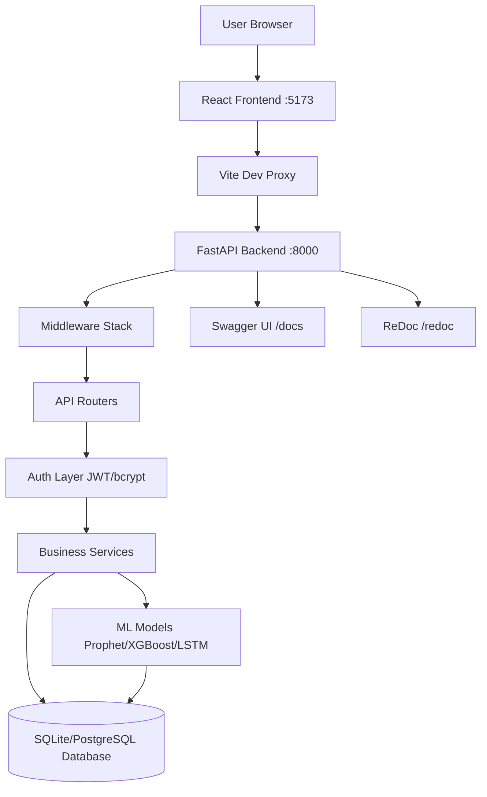

### 2.2 Layer Architecture

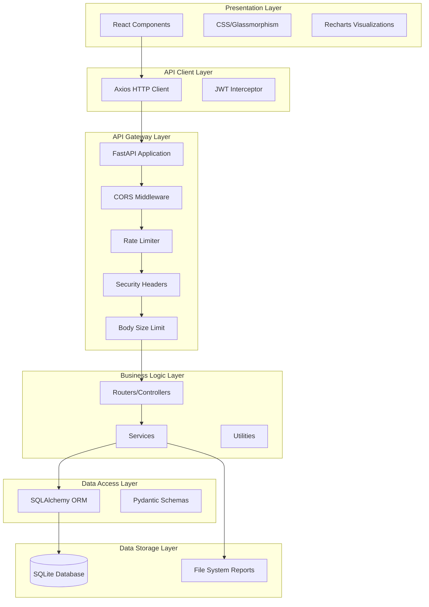

### 2.3 Client-Server Diagram

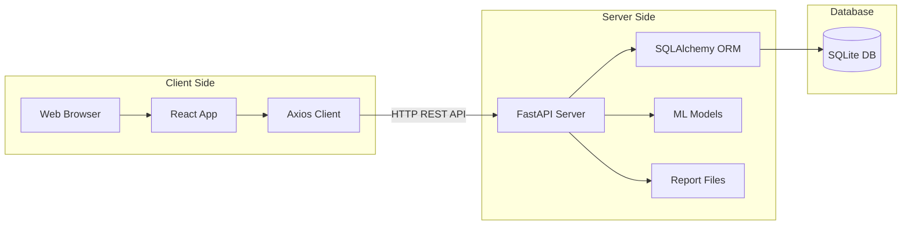

### 2.4 Folder Architecture

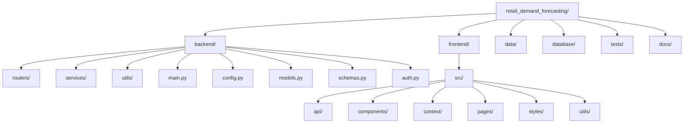

### 2.5 Data Flow Diagram — Level 0 (Context Diagram)

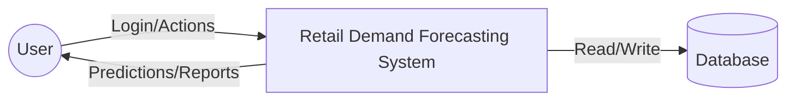

### 2.6 Data Flow Diagram — Level 1

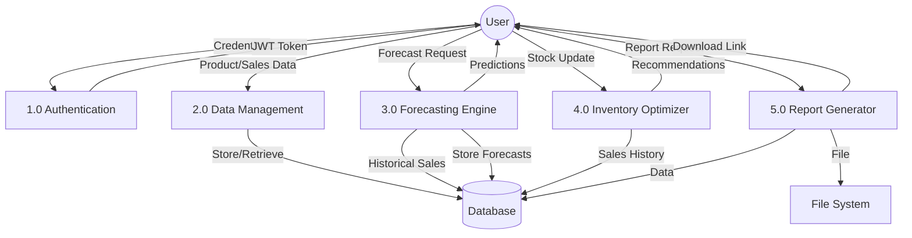

### 2.7 Data Flow Diagram — Level 2 (Forecasting Detail)

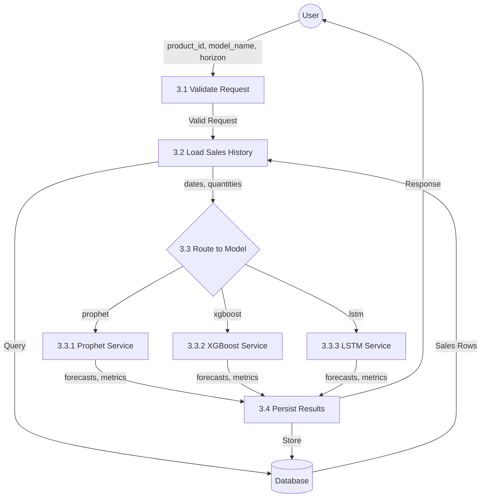

### 2.8 Sequence Diagram — Login Flow

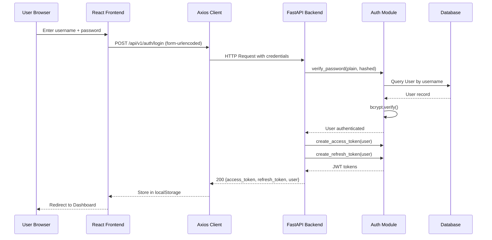

### 2.9 Sequence Diagram — Forecast Flow

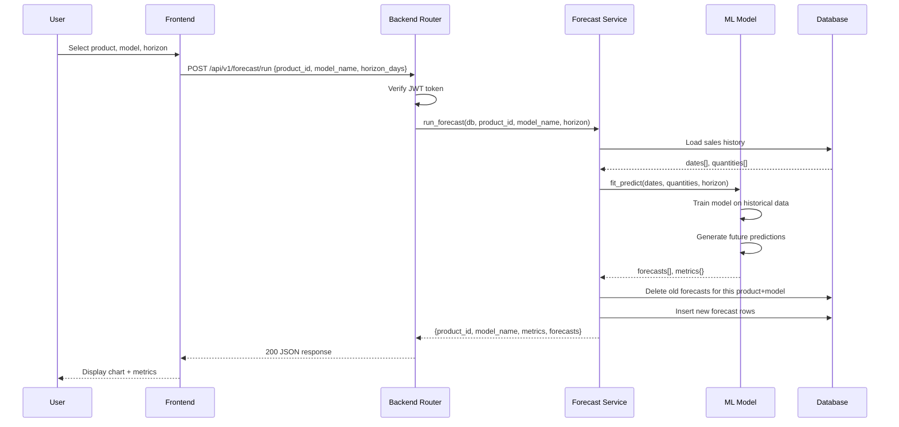

### 2.10 Activity Diagram — User Workflow

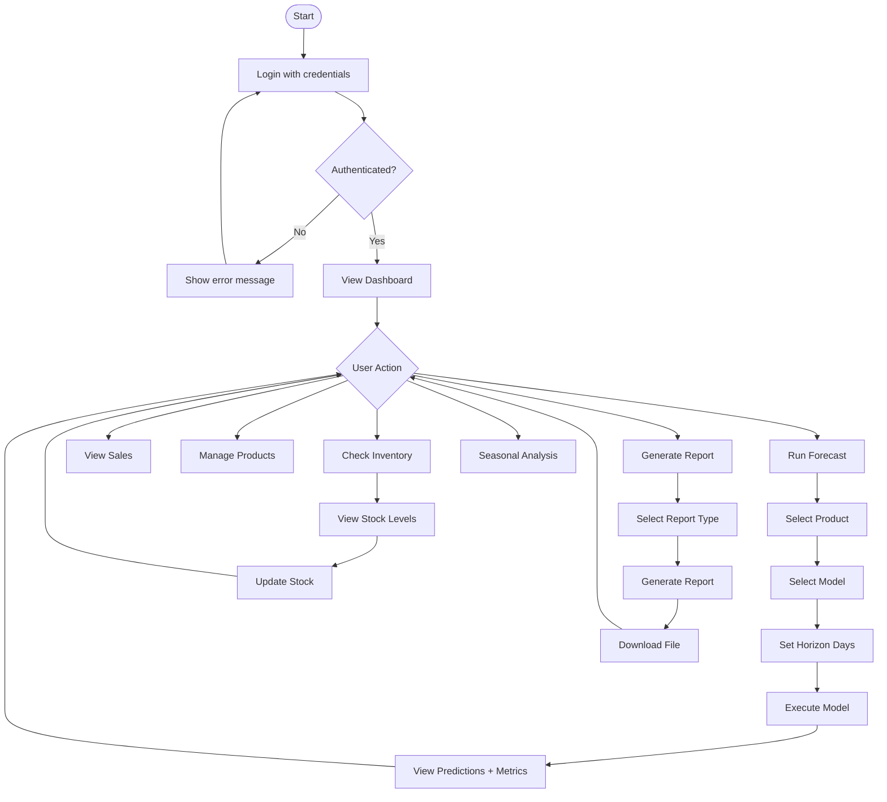

### 2.11 Component Diagram

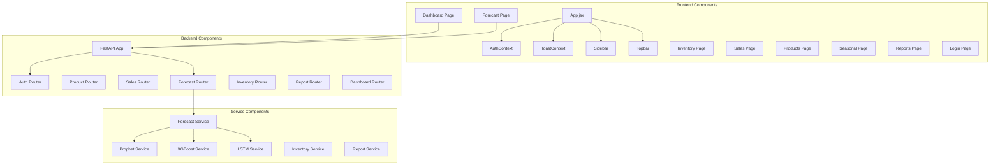

### 2.12 ER Diagram (Entity Relationship)

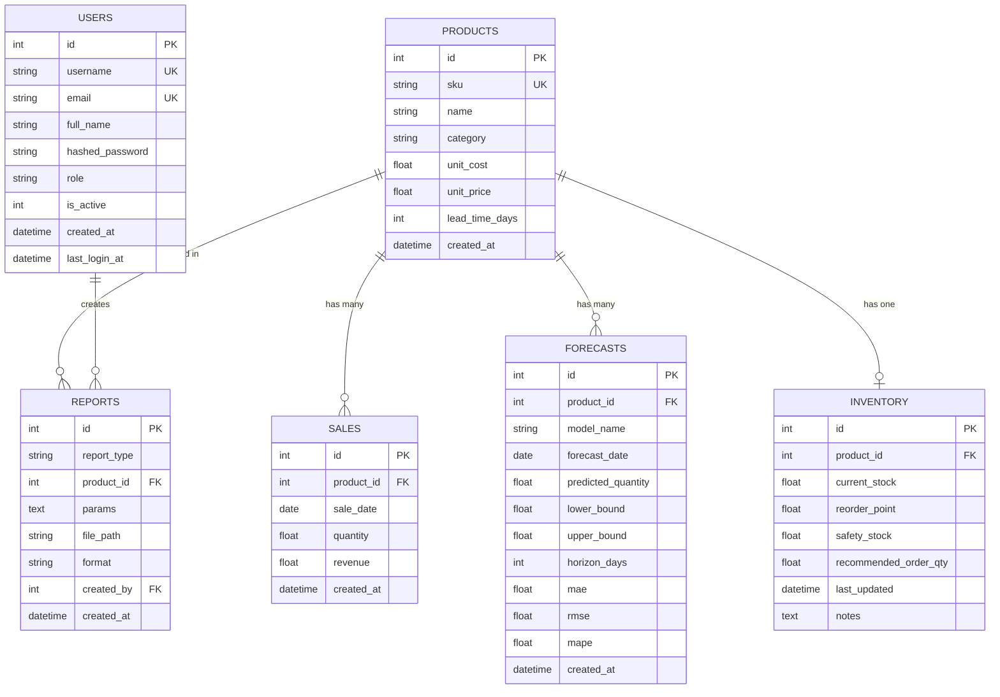

### 2.13 API Communication Diagram

```mermaid
graph LR
    subgraph Frontend
        RC[React Components]
    end
    subgraph API Layer
        AX[Axios Client]
    end
    subgraph Backend Endpoints
        AUTH[/auth/login POST]
        PROD[/products GET/POST]
        SALE[/sales GET/POST]
        FC[/forecast/run POST]
        INV[/inventory GET/PUT]
        REP[/reports/generate POST]
        DASH[/dashboard/summary GET]
    end
    RC --> AX
    AX --> AUTH
    AX --> PROD
    AX --> SALE
    AX --> FC
    AX --> INV
    AX --> REP
    AX --> DASH
```

### 2.14 Authentication Flow Diagram

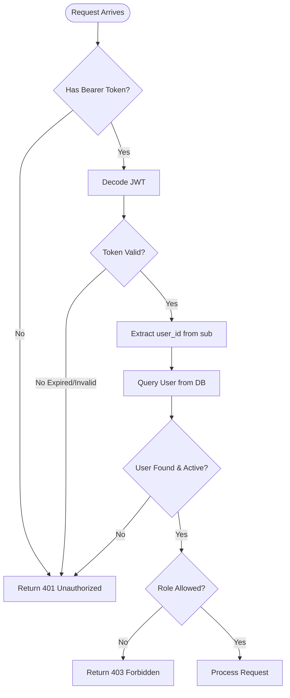

### 2.15 Request Lifecycle Diagram

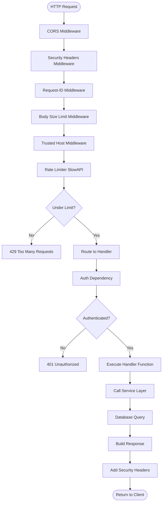

### Learning Notes — Section 2

**Key Takeaways:**
- The project follows a layered architecture: Presentation → API Client → API Gateway → Business Logic → Data Access → Storage.
- Middleware stack executes in order: CORS → Security Headers → Request ID → Body Size → Trusted Host → Rate Limiter.
- Three ML models share a common interface (`fit_predict`) enabling the registry pattern.
- The ER diagram shows 6 tables with clear foreign-key relationships.

**Things to Remember:**
- Every request passes through 6 middleware layers before reaching the handler.
- JWT token is validated on every protected endpoint via the `get_current_user` dependency.
- The Vite dev proxy forwards `/api/v1/*` from port 5173 to port 8000.

---

## Section 3 — Technology Stack

### 3.1 Python 3.12

| Aspect | Detail |
|--------|--------|
| **What is it?** | A high-level, interpreted, general-purpose programming language |
| **Why is it used?** | Backend development, ML/AI libraries, data science ecosystem |
| **Who created it?** | Guido van Rossum (1991) |
| **Advantages** | Readable syntax, massive library ecosystem, ML/AI dominance, rapid prototyping |
| **Disadvantages** | Slower than compiled languages (C/Java), GIL limits true parallelism |
| **Alternatives** | Java, Go, Rust, Node.js |
| **Why selected?** | Best ecosystem for ML (TensorFlow, Prophet, XGBoost all native Python); FastAPI is Python-based |

### 3.2 FastAPI 0.115

| Aspect | Detail |
|--------|--------|
| **What is it?** | A modern, high-performance Python web framework for building APIs |
| **Why is it used?** | Automatic API documentation, type validation, async support, high performance |
| **Who created it?** | Sebastián Ramírez (2018) |
| **Advantages** | Auto Swagger docs, Pydantic validation, async/await, dependency injection, type hints |
| **Disadvantages** | Younger ecosystem than Django/Flask, fewer tutorials, requires Python 3.7+ |
| **Alternatives** | Django REST Framework, Flask, Express.js (Node), Spring Boot (Java) |
| **Why selected?** | Auto-generated Swagger, native Pydantic integration for ML schemas, async for LSTM training, fastest Python framework |

### 3.3 React 18

| Aspect | Detail |
|--------|--------|
| **What is it?** | A JavaScript library for building user interfaces |
| **Why is it used?** | Component-based UI, virtual DOM for performance, large ecosystem |
| **Who created it?** | Meta (Facebook) — Jordan Walke (2013) |
| **Advantages** | Component reusability, virtual DOM, huge community, React DevTools |
| **Disadvantages** | JSX learning curve, frequent updates, no built-in state management |
| **Alternatives** | Vue.js, Angular, Svelte, Solid.js |
| **Why selected?** | Most popular frontend library, excellent charting libraries (Recharts), large job market |

### 3.4 Vite 5

| Aspect | Detail |
|--------|--------|
| **What is it?** | A next-generation frontend build tool that offers blazing fast development experience |
| **Why is it used?** | Instant Hot Module Replacement (HMR), fast cold starts, dev server proxy |
| **Who created it?** | Evan You (creator of Vue.js) — 2020 |
| **Advantages** | 10-100x faster than Webpack, native ES modules, built-in proxy, simple config |
| **Disadvantages** | Newer ecosystem, some plugins not yet available |
| **Alternatives** | Webpack, Parcel, Rollup, esbuild |
| **Why selected?** | Fastest dev server, built-in proxy for API forwarding, native React support |

### 3.5 SQLAlchemy 2.0

| Aspect | Detail |
|--------|--------|
| **What is it?** | The Python SQL toolkit and Object-Relational Mapper (ORM) |
| **Why is it used?** | Maps Python classes to database tables, provides query abstraction |
| **Who created it?** | Mike Bayer (2006) |
| **Advantages** | Database-agnostic, powerful query builder, relationship handling, migration support |
| **Disadvantages** | Learning curve, can be slower than raw SQL for complex queries |
| **Alternatives** | Django ORM, Peewee, Tortoise ORM, raw SQL |
| **Why selected?** | Industry standard, works with both SQLite and PostgreSQL, integrates perfectly with FastAPI |

### 3.6 Pydantic v2

| Aspect | Detail |
|--------|--------|
| **What is it?** | Data validation library using Python type annotations |
| **Why is it used?** | Request/response validation, automatic JSON schema generation, type safety |
| **Who created it?** | Samuel Colvin (2017) |
| **Advantages** | Type safety, automatic validation, JSON Schema generation, FastAPI integration |
| **Disadvantages** | v1 to v2 migration breaking changes, learning curve for validators |
| **Alternatives** | marshmallow, attrs, dataclasses |
| **Why selected?** | Native FastAPI integration (auto-generates Swagger schemas), v2 is 5-50x faster than v1 |

### 3.7 SQLite

| Aspect | Detail |
|--------|--------|
| **What is it?** | A self-contained, serverless, zero-configuration SQL database engine |
| **Why is it used?** | Development database, zero setup required, single file storage |
| **Who created it?** | D. Richard Hipp (2000) |
| **Advantages** | Zero configuration, single file, no server needed, ACID compliant, fast reads |
| **Disadvantages** | Write locking (one writer at a time), no network access, limited concurrency |
| **Alternatives** | PostgreSQL, MySQL, MariaDB, MongoDB |
| **Why selected?** | Zero-config for development; project supports PostgreSQL for production via DATABASE_URL |

### 3.8 Prophet 1.1.5

| Aspect | Detail |
|--------|--------|
| **What is it?** | A forecasting procedure for time series data based on an additive model |
| **Why is it used?** | Handles seasonality, holidays, missing data; designed for business forecasting |
| **Who created it?** | Meta (Facebook) Research — Sean Taylor & Ben Letham (2017) |
| **Advantages** | Handles missing data, outliers, seasonal effects; no feature engineering needed |
| **Disadvantages** | Requires cmdstanpy backend, slower than XGBoost, black-box nature |
| **Alternatives** | ARIMA, SARIMA, ETS, Holt-Winters |
| **Why selected?** | Best for products with strong weekly/monthly seasonality patterns and missing data tolerance |

### 3.9 XGBoost 2.1.1

| Aspect | Detail |
|--------|--------|
| **What is it?** | An optimized distributed gradient boosting library (decision trees) |
| **Why is it used?** | Feature-based forecasting with lag/rolling features, captures non-linear relationships |
| **Who created it?** | Tianqi Chen (2014) — University of Washington |
| **Advantages** | Fast training, handles missing values, feature importance, regularization |
| **Disadvantages** | Requires feature engineering, no native time-series support, can overfit |
| **Alternatives** | LightGBM, CatBoost, Random Forest, Gradient Boosting |
| **Why selected?** | Excellent for tabular data with engineered features; captures complex lag interactions |

### 3.10 TensorFlow 2.16 (LSTM)

| Aspect | Detail |
|--------|--------|
| **What is it?** | An open-source machine learning framework for deep learning |
| **Why is it used?** | LSTM neural network for capturing long-range temporal dependencies |
| **Who created it?** | Google Brain team (2015) |
| **Advantages** | GPU acceleration, Keras high-level API, production deployment, large community |
| **Disadvantages** | Large installation size (~500MB), slower on CPU, complex debugging |
| **Alternatives** | PyTorch, JAX, MXNet |
| **Why selected?** | Keras Sequential API simplifies LSTM implementation; industry standard for production ML |

### 3.11 NumPy 1.26

| Aspect | Detail |
|--------|--------|
| **What is it?** | The fundamental package for numerical computing in Python |
| **Why is it used?** | Array operations, mathematical functions, data normalization |
| **Who created it?** | Travis Oliphant (2005) |
| **Advantages** | Vectorized operations (100x faster than Python loops), memory efficient, broadcasting |
| **Disadvantages** | Only handles numerical data, not a full data manipulation library |
| **Alternatives** | SciPy (extends NumPy), CuPy (GPU) |
| **Why selected?** | Required by all ML libraries; used for metrics computation and data normalization |

### 3.12 Pandas 2.2

| Aspect | Detail |
|--------|--------|
| **What is it?** | A data manipulation and analysis library providing DataFrames |
| **Why is it used?** | Time series manipulation, data grouping, feature engineering |
| **Who created it?** | Wes McKinney (2008) |
| **Advantages** | DataFrame operations, time series support, CSV/JSON I/O, groupby |
| **Disadvantages** | Memory-heavy for large datasets, slow for row-by-row operations |
| **Alternatives** | Polars (faster), Dask (distributed), Vaex |
| **Why selected?** | Standard for time-series data manipulation; integrates with all ML libraries |

### 3.13 scikit-learn 1.5.1

| Aspect | Detail |
|--------|--------|
| **What is it?** | A machine learning library providing tools for data analysis and modeling |
| **Why is it used?** | Required as XGBoost's scikit-learn API dependency |
| **Who created it?** | David Cournapeau (2007); maintained by Inria |
| **Advantages** | Consistent API, comprehensive algorithms, excellent documentation |
| **Disadvantages** | Not designed for deep learning, limited GPU support |
| **Alternatives** | statsmodels, mlpack |
| **Why selected?** | XGBoost's `XGBRegressor` uses scikit-learn's estimator interface |

### 3.14 Axios

| Aspect | Detail |
|--------|--------|
| **What is it?** | A promise-based HTTP client for the browser and Node.js |
| **Why is it used?** | API calls from React frontend, request/response interceptors for JWT |
| **Who created it?** | Matt Zabriskie (2014) |
| **Advantages** | Interceptors, automatic JSON transforms, timeout support, cancellation |
| **Disadvantages** | Extra dependency (fetch is built-in), slightly larger bundle |
| **Alternatives** | fetch API (native), ky, got (Node), superagent |
| **Why selected?** | Interceptor pattern perfect for JWT token injection; cleaner API than fetch |

### 3.15 Recharts

| Aspect | Detail |
|--------|--------|
| **What is it?** | A composable charting library built on React and D3 |
| **Why is it used?** | Dashboard charts (area, bar, pie/donut), responsive, React-native |
| **Who created it?** | Recharts team (open source, 2016) |
| **Advantages** | Declarative React components, responsive, customizable, good documentation |
| **Disadvantages** | Less performant than canvas-based libraries for large datasets |
| **Alternatives** | Chart.js, Victory, Nivo, D3.js (raw), ApexCharts |
| **Why selected?** | React-native components, easy integration, beautiful default styles |

### 3.16 JWT (JSON Web Tokens)

| Aspect | Detail |
|--------|--------|
| **What is it?** | An open standard (RFC 7519) for securely transmitting information as JSON objects |
| **Why is it used?** | Stateless authentication — no server-side session storage needed |
| **Who created it?** | IETF (Internet Engineering Task Force) — 2015 |
| **Advantages** | Stateless, scalable, self-contained, cross-domain support |
| **Disadvantages** | Cannot be revoked once issued (until expiry), token size |
| **Alternatives** | Session cookies, OAuth2, SAML, Paseto |
| **Why selected?** | Stateless (no Redis/session store needed), works perfectly with SPA frontends |

### 3.17 bcrypt

| Aspect | Detail |
|--------|--------|
| **What is it?** | A password-hashing function based on the Blowfish cipher |
| **Why is it used?** | Secure password storage — intentionally slow to resist brute-force attacks |
| **Who created it?** | Niels Provos and David Mazières (1999) |
| **Advantages** | Adaptive cost factor (work factor 12 = slow), built-in salt, time-tested |
| **Disadvantages** | Slower than SHA-256 (by design), 72-byte password limit |
| **Alternatives** | Argon2 (newer, winner of PHC), scrypt, PBKDF2 |
| **Why selected?** | Industry standard, supported by passlib, adjustable work factor |

### 3.18 python-jose

| Aspect | Detail |
|--------|--------|
| **What is it?** | A JOSE (JSON Object Signing and Encryption) implementation in Python |
| **Why is it used?** | JWT token creation and verification (encode/decode) |
| **Who created it?** | Michael Davis |
| **Advantages** | Supports multiple algorithms (HS256, RS256), lightweight, well-maintained |
| **Disadvantages** | Not as actively maintained as PyJWT |
| **Alternatives** | PyJWT, authlib, joserfc |
| **Why selected?** | Recommended by FastAPI documentation for JWT handling |

### 3.19 slowapi

| Aspect | Detail |
|--------|--------|
| **What is it?** | A rate limiting library for FastAPI/Starlette applications |
| **Why is it used?** | Per-IP request rate limiting to prevent abuse and brute-force attacks |
| **Who created it?** | Laurent Savaëte |
| **Advantages** | Easy integration with FastAPI, per-IP/per-endpoint limiting, customizable |
| **Disadvantages** | In-memory storage (not distributed), limited to single-server |
| **Alternatives** | fastapi-limiter, custom middleware, Redis-based limiting |
| **Why selected?** | Simplest rate limiting for single-server deployment; no Redis dependency |

### 3.20 Uvicorn

| Aspect | Detail |
|--------|--------|
| **What is it?** | A lightning-fast ASGI (Asynchronous Server Gateway Interface) server |
| **Why is it used?** | Runs the FastAPI application, handles HTTP connections |
| **Who created it?** | Tom Christie (2018) |
| **Advantages** | Fast (based on uvloop), supports HTTP/1.1 and WebSockets, auto-reload |
| **Disadvantages** | Single-worker by default (use Gunicorn for multi-worker) |
| **Alternatives** | Gunicorn, Hypercorn, Daphne |
| **Why selected?** | Recommended ASGI server for FastAPI; development-friendly with --reload |

### 3.21 React Router

| Aspect | Detail |
|--------|--------|
| **What is it?** | A standard routing library for React applications |
| **Why is it used?** | Client-side routing between pages (Dashboard, Forecast, Inventory, etc.) |
| **Who created it?** | Remix Software (Ryan Florence & Michael Jackson) |
| **Advantages** | Declarative routing, nested routes, protected routes, navigation hooks |
| **Disadvantages** | API changes between major versions, learning curve |
| **Alternatives** | Next.js routing, TanStack Router, Wouter |
| **Why selected?** | Industry standard for React SPA routing; supports protected routes pattern |

### 3.22 Lucide React (Icons)

| Aspect | Detail |
|--------|--------|
| **What is it?** | A beautiful & consistent icon toolkit (fork of Feather Icons) |
| **Why is it used?** | Sidebar navigation icons, action buttons, status indicators |
| **Who created it?** | Lucide community (fork of Feather Icons by Cole Bemis) |
| **Advantages** | Tree-shakeable, consistent design, SVG-based, React components |
| **Disadvantages** | Fewer icons than Font Awesome or Material Icons |
| **Alternatives** | Font Awesome, Material Icons, Heroicons, Phosphor Icons |
| **Why selected?** | Lightweight, modern design, tree-shakeable (only import what you use) |

### 3.23 passlib

| Aspect | Detail |
|--------|--------|
| **What is it?** | A password hashing framework for Python |
| **Why is it used?** | Wraps bcrypt with a clean API, handles deprecated schemes |
| **Who created it?** | Eli Collins |
| **Advantages** | Multiple hash scheme support, automatic upgrade path, constant-time verify |
| **Disadvantages** | Additional abstraction layer over bcrypt |
| **Alternatives** | Direct bcrypt library, argon2-cffi |
| **Why selected?** | Recommended by FastAPI for password hashing; provides `CryptContext` for scheme management |

### 3.24 pydantic-settings

| Aspect | Detail |
|--------|--------|
| **What is it?** | Pydantic extension for loading settings from environment variables and .env files |
| **Why is it used?** | Centralized configuration management with type validation |
| **Who created it?** | Samuel Colvin (Pydantic team) |
| **Advantages** | Type-safe config, .env support, validation, default values |
| **Disadvantages** | Separate package from pydantic v2 |
| **Alternatives** | python-decouple, dynaconf, environs |
| **Why selected?** | Native Pydantic integration; auto-validates environment variables |

### Learning Notes — Section 3

**Key Takeaways:**
- Python was chosen for its ML ecosystem; JavaScript/React for its UI capabilities.
- Three ML libraries (Prophet, XGBoost, TensorFlow) each serve different use cases.
- FastAPI was chosen over Flask/Django for auto-documentation and async support.
- SQLite is used for development simplicity; PostgreSQL for production.

**Things to Remember:**
- Prophet needs cmdstanpy backend (pin cmdstanpy==1.2.4 on Windows).
- TensorFlow is ~500MB; use `--skip-ml` flag in installer to skip if not needed.
- Pydantic v2 has breaking changes from v1 (use `model_validate` instead of `from_orm`).

**Interview Tips:**
- "Why FastAPI over Django?" → Auto Swagger docs, async support, type validation, faster.
- "Why SQLite?" → Zero-config development; DATABASE_URL switch enables PostgreSQL.
- "Why three models?" → Each excels in different scenarios; comparison identifies the best.

---

## Section 4 — Complete Folder Structure

See **Volume 2** of this document for Sections 4-26.

